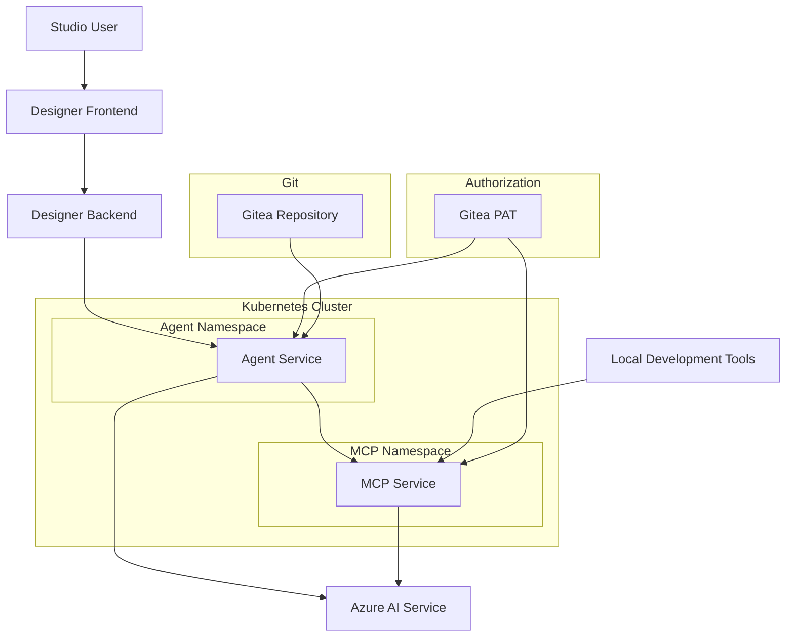

# Deploying Studio AI agents and MCP service

- Status: Draft
- Deciders: Team Altinn Studio/Digdir R&D lab
- Date: 30.10.2025

## Result

## Problem context

The new AI assistant in Studio is dependent on both an agent service and an MCP service. There is a need to deploy these services, so that the AI assistant in Studio can run entirely online, without having to run the services locally.

When a prompt is entered in Designer frontend, it goes via Designer backend, to the agent server. Then, the agent gathers context by calling on tools from the MCP server. Lastly, the agent saves its work into a new branch in Gitea.

The agent and the MCP are separated because we want to allow users of tools like Claude Code and Windsurf to use the MCP as a separate service for developing apps locally.

We will limit the access to the agent and MCP to registered service owners, in order to reduce token usage and possible abuses of the services by third parties. Authorization will be done via a Gitea PAT token.

Both services will have their own API key to connect to the Azure AI service, in order to track API usage for each service. The API requests should include metadata in order to track the usage for each service owner. The API requests will also be rate limited, to prevent excessive usage.

## Decision drivers

- D1: Services must be accessible online for Studio Designer frontend
- D2: MCP service must be usable independently by local development tools
- D3: Services must not leak access into other parts of the cluster
- D4: Must support authorization via Gitea PAT tokens to permit access to registered service owners only
- D5: Operational costs must be manageable and monitorable
- D6: Services must be scalable to handle growing usage

## Alternatives considered

- A1: Deploy agent service and MCP service as separate containerized applications in the existing Altinn Studio infrastructure. Use namespaces for isolation and implement Gitea PAT token authorization at the service level.

## Pros and cons

### A1

- Good, because it fulfills D1 by deploying both services as accessible endpoints within the Studio infrastructure
- Good, because it fulfills D2 by deploying MCP as a separate, independently accessible service that local development tools can connect to
- Good, because it fulfills D3 by using Kubernetes namespaces to isolate the services and prevent unauthorized access to other parts of the cluster
- Good, because it fulfills D4 by allowing implementation of Gitea PAT token authorization
- Good, because it fulfills D5 by tracking usage for each service and service owner
- Good, because it fulfills D6 by having separate services that allow independent scaling

## Architecture Overview

