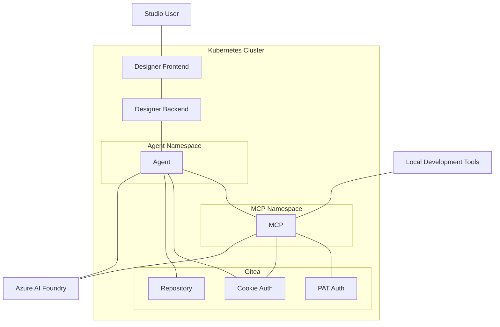

# Deploying Studio AI agent and MCP

- Status: Draft
- Deciders: Team Altinn Studio/Digdir R&D lab
- Date: 31.10.2025

## Result

A3 - Deploy agent and MCP as separate containerized applications in the Altinn Studio infrastructure. Use cookies from Studio for authorization, with fallback to Gitea PAT token authorization for MCP.

## Problem context

The new AI assistant in Studio is dependent on both an agent service and an MCP service. There is a need to deploy these services, so that the AI assistant in Studio can run entirely online, without having to run the services locally.

When a prompt is entered in Designer frontend, it goes via Designer backend, to the agent server. Then, the agent gathers context by calling on tools from the MCP server. Lastly, the agent saves its work into a new branch in Gitea.

The agent and the MCP are separated because we also want to allow developers to use the MCP when developing apps locally.

We will limit the access to the agent and MCP to Testdepartementet and registered service owners, in order to reduce token usage and abuse by malicious actors.

Both services will have their own API key to connect to the Azure AI service, in order to track API usage for each service. The API requests will also be rate limited, to prevent excessive usage.

## Decision drivers

- D1: Services must be accessible online through Studio Designer
- D2: MCP service must be accessible through local development tools
- D3: Services must not leak access into other parts of the cluster
- D4: Services must be scalable to handle growing usage

## Alternatives considered

- A1: Deploy agent and MCP as separate containerized applications in the Altinn Studio infrastructure. Use cookies from Studio for authorization.
- A2: Deploy agent and MCP as separate containerized applications in the Altinn Studio infrastructure. Implement Gitea PAT token authorization for both services.
- A3: Deploy agent and MCP as separate containerized applications in the Altinn Studio infrastructure. Use cookies from Studio for authorization, with fallback to Gitea PAT token authorization for MCP.

## Pros and cons

### A1

- Good, because it fulfills D1 by authenticating users via Studio cookies
- Good, because it fulfills D3 by using Kubernetes namespaces to isolate the services and prevent unauthorized access to other parts of the cluster
- Good, because it fulfills D4 by having separate services that allow independent scaling
- Bad, because it does not fulfill D2 by making access dependent upon Studio cookies

### A2

- Good, because it fulfills D2 by authenticating users with Gitea PAT token
- Good, because it fulfills D3 by using Kubernetes namespaces to isolate the services and prevent unauthorized access to other parts of the cluster
- Good, because it fulfills D4 by having separate services that allow independent scaling
- Bad, because it does not fulfill D1 without establishing PAT token authentication in Studio

### A3

- Good, because it fulfills D1 by authenticating users via Studio cookies
- Good, because it fulfills D2 by authenticating users with Gitea PAT token
- Good, because it fulfills D3 by using Kubernetes namespaces to isolate the services and prevent unauthorized access to other parts of the cluster
- Good, because it fulfills D4 by having separate services that allow independent scaling

## Architecture Overview

