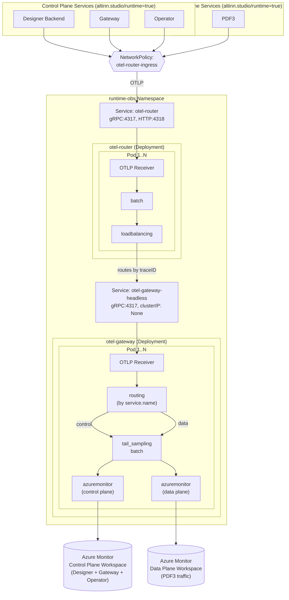

# Monitoring telemetry collection and distribution

- Status: Proposed
- Deciders: Team
- Date: 21.01.2026

## Result

A4: Two-stage Deployment-based collector pipeline with load-balancing router, tail-sampling gateway,
and routing to different Azure Monitor workspaces based on control plane vs data plane classification.

## Problem context

Altinn Studio needs centralized monitoring for runtime services deployed across 100+ service owner clusters.
This decision implements monitoring recommendations from [altinn-decision-log#3](https://github.com/Altinn/altinn-decision-log/issues/3),
which established the adoption of OpenTelemetry for observability across Altinn 3 platform.
We also need to have consistent implementations and shared understanding across all our services to simplify operational aspects and maintenance,
as we will have similar technical needs across the board (e.g. availability, tail sampling).

Altinn Studio operates two architectural planes:

**Control plane** (app lifecycle management, orchestration):
- Designer Backend: App development, publishing, deployment orchestration
- Gateway: API gateway for service owner clusters/runtimes (let Designer and the global control plane be runtime/infra-agnostic)
- Operator: k8s-specific infrastructure automation and provisioning
- Distributed traces span Designer, ADO, Gateway, operator flows for app deployments

**Data plane** (end-user/service owner traffic):
- PDF3: PDF generation service handling production user requests
- Apps: Service owner developed applications

Requirements from [altinn-platform#2614](https://github.com/Altinn/altinn-platform/issues/2614):
- OTLP protocol support for push-based export
- Intelligent sampling to reduce telemetry volume and cost
- Self-service sampling/filtering configuration
- Enrichment based on source environment
- Export to Azure Monitor for traces, metrics, and logs
  - **NOTE**: there are intentions to route metrics to Prometheus (Azure managed solution) as opposed to Azure Monitor/Application Insights in DIS

## Decision drivers

- D1: Tail sampling requires trace continuity - all spans of a trace must reach the same collector
- D2: Cost efficiency - reduce telemetry volume through intelligent sampling (errors, slow traces, probabilistic)
- D3: Scalability - ability to scale to >1 replicas without compromising correctness
- D4: Security - restrict telemetry ingestion where possible (e.g. only runtime svcs should access runtime collectors)
- D5: Operational simplicity - minimize per-service configuration burden
- D6: Azure Monitor integration - we are tied to Azure Monitor infra at the moment
- D7: High availability - 1 zone acceptable for dev/test, minimum 2 zones for yt/prod environments
- D8: Durability/resiliency - offload telemetry from applications quickly; collection system handles buffering and retries (in addition to default buffering and batching in SDKs)
- D9: Telemetry routing - route control plane and data plane telemetry to different Azure Monitor workspaces based on service classification
- D10: Backend flexibility - enable switching from Azure Monitor to alternative OTLP-based backends through infrastructure configuration changes only, without modifying apps or runtime services

## Alternatives considered

- A1: Single collector Deployment
- A2: DaemonSet collector (one per node)
- A3: Sidecar collector (one per pod)
- A4: Two-stage Deployment pipeline (router + gateway)

Non-OTel collector options not really considered, as DIS and others seem to be standardizing on this.

## Pros and cons

### A1: Single collector Deployment

- Good, because simple to deploy and manage (D5)
- Good, because tail sampling works correctly with single instance (D1)
- Bad, because single point of failure, no horizontal scaling (D7)
- Bad, because cannot scale independently for ingestion vs. export workloads (D3)
- Bad, because no buffering resilience if the single instance restarts (D8)

### A2: DaemonSet collector (one per node)

- Good, because scales with cluster size automatically
- Good, because low network latency for telemetry ingestion
- Good, because inherently HA - pods on each node (D7)
- Bad, because tail sampling cannot work - spans of same trace land on different nodes (D1)
- Bad, because resource overhead on every node regardless of workload

### A3: Sidecar collector (one per pod)

- Good, because isolated failure domain per application
- Good, because application-specific configuration possible
- Good, because inherently HA - collector tied to app lifecycle (D7)
- Bad, because tail sampling cannot work - each pod has isolated view (D1)
- Bad, because significant resource overhead (100+ sidecars per cluster)
- Bad, because configuration management complexity (D5)

### A4: Two-stage Deployment pipeline (router + gateway) with multi-workspace routing

- Good, because enables tail sampling with proper trace routing (D1)
  - Router load-balances by traceID ensuring all spans reach same gateway
- Good, because supports routing to multiple Azure Monitor workspaces (D6, D9)
  - Gateway uses routing processor to classify services by service.name
  - Control plane services (designer, studio-gateway, operator) → control plane workspace
  - Data plane services (pdf3) → data plane workspace
- Good, because decouples services from monitoring backend through OTLP (D10)
  - Services export to OTLP collectors, not directly to Azure Monitor
  - Backend changes (e.g., switching to Prometheus, Grafana LGTM, or other OTLP-compatible systems) only require collector configuration updates
  - No code changes needed in apps or runtime services
- Good, because stages can scale independently based on workload (D3)
- Good, because tail sampling at gateway reduces export volume significantly (D2)
  - Configured: errors (100%), slow >1s (100%), probabilistic (10%)
- Good, because NetworkPolicy restricts ingestion to labeled namespaces (D4)
- Good, because centralized configuration, no per-app changes needed (D5)
- Good, because topology spread constraints enable multi-zone HA (D7)
  - Configurable per environment: 1 replica for dev/test, 2+ for yt/prod
- Good, because collectors buffer and retry, offloading apps from export concerns (D8)
  - Batching at router, queued retry at gateway
- OK, more complex than single deployment, but operationally manageable
- Bad, because two components to monitor and maintain
- Bad, because routing configuration must be kept in sync with service classification

## Appendix: Architecture diagram



### Traffic flow

1. **Runtime services** send telemetry (traces, metrics, logs) via OTLP to `otel-router`
   - NetworkPolicy restricts ingress to namespaces with label `altinn.studio/runtime=true`
2. **otel-router** batches and load-balances by traceID to gateway replicas via headless service DNS
3. **otel-gateway** routing processor classifies telemetry by `service.name`:
   - Control plane: `designer|studio-gateway|operator` → control plane pipeline
   - Data plane: `pdf3` → data plane pipeline
4. **Tail sampling** applied per pipeline (errors 100%, slow >1s 100%, probabilistic 10%)
5. **Export** to respective Azure Monitor workspaces:
   - Control plane workspace: Designer, Gateway, Operator telemetry (enables distributed tracing across app deployment flows)
   - Data plane workspace: PDF3 telemetry (isolated, team-owned for operational monitoring)

### Service instrumentation requirements

All runtime services should:
- Use OpenTelemetry SDK and export via OTLP protocol to `otel-router` service
- Set appropriate `service.name` resource attribute for routing classification
- Propagate W3C TraceContext for distributed tracing

Note: Designer Backend currently uses legacy Application Insights SDK. Migration to OpenTelemetry will be addressed separately.

## Configuration details

### Gateway routing processor

```yaml
processors:
  routing:
    from_attribute: service.name
    table:
      - value: designer
        exporters: [control_plane]
      - value: studio-gateway
        exporters: [control_plane]
      - value: operator
        exporters: [control_plane]
      - value: pdf3
        exporters: [data_plane]
    default_exporters: [data_plane]

exporters:
  azuremonitor/control_plane:
    connection_string: ${CONTROL_PLANE_CONNECTION_STRING}
  azuremonitor/data_plane:
    connection_string: ${DATA_PLANE_CONNECTION_STRING}

service:
  pipelines:
    traces:
      receivers: [otlp]
      processors: [routing, tail_sampling, batch]
      exporters: [azuremonitor/control_plane, azuremonitor/data_plane]
```

### Secret management

Two Azure Monitor connection strings configured in `runtime-obs` namespace:
- `control-plane-azure-monitor-secret`: Control plane workspace
- `data-plane-azure-monitor-secret`: Data plane workspace (tenant subscription)

Both secrets synced from Azure Key Vault via Operator AzureKeyVaultSync controller.
