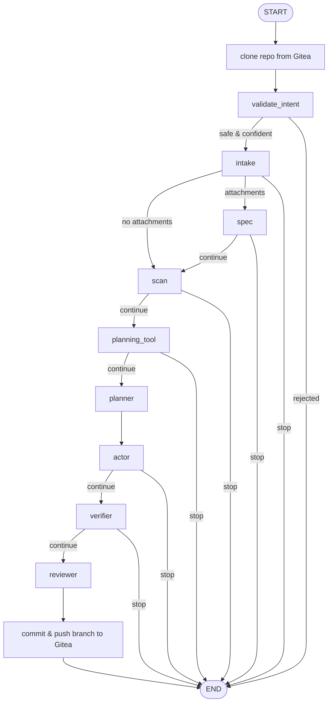

```mermaid
flowchart TD
    Start([START]) --> clone[clone repo from Gitea]
    clone --> validate_intent
    validate_intent -->|safe & confident| intake
    validate_intent -->|rejected| End([END])
    intake -->|no attachments| scan
    intake -->|attachments| spec
    intake -->|stop| End
    spec -->|continue| scan
    spec -->|stop| End
    scan -->|continue| planning_tool
    scan -->|stop| End
    planning_tool -->|continue| planner
    planning_tool -->|stop| End
    planner --> actor
    actor -->|continue| verifier
    actor -->|stop| End
    verifier -->|continue| reviewer
    verifier -->|stop| End
    reviewer --> push[commit & push branch to Gitea]
    push --> End
```
