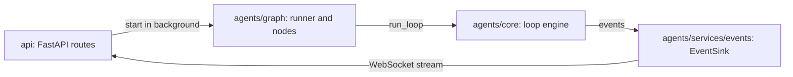
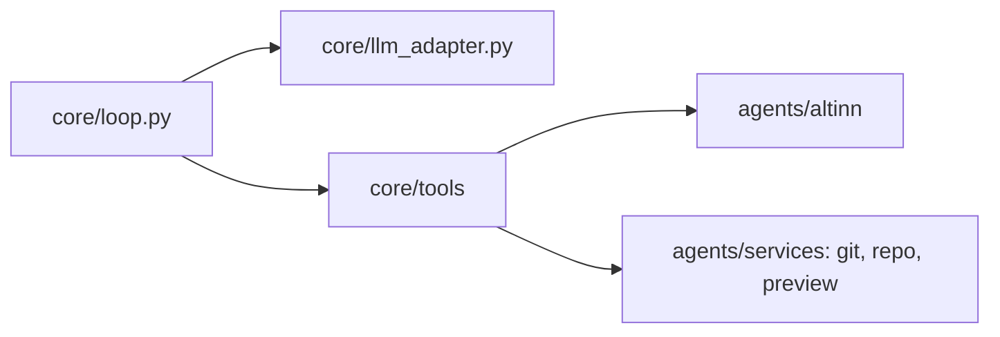
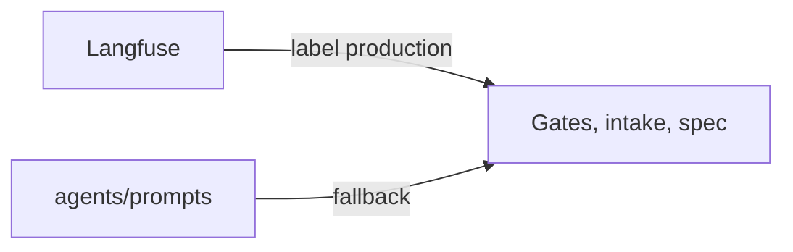
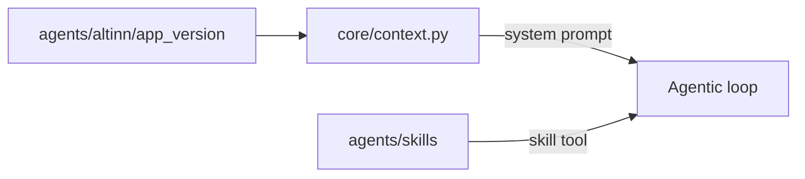
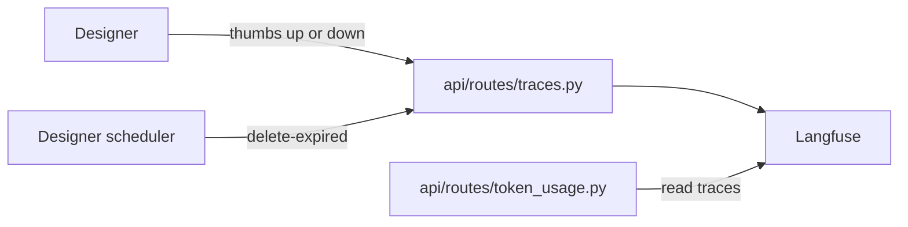
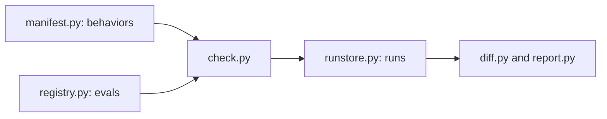
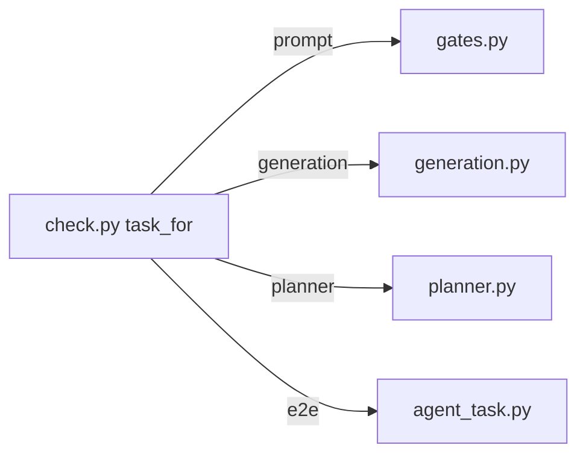

# Level 3: Modules

_What main modules does the service have, and how do they operate together?_

The service is one Python process. It uses `asyncio`, so many runs can share the process. A small LangGraph graph sets the order of the steps. The agentic loop itself is plain Python code in `agents/core/loop.py`.

| Folder               | Job                                                                                                                                             |
| -------------------- | ----------------------------------------------------------------------------------------------------------------------------------------------- |
| `api/`               | FastAPI app. HTTP routes, the `/ws` WebSocket, rate limits.                                                                                     |
| `agents/graph/`      | Runs the gates, then the graph: intake → spec → agentic loop. Holds `AgentState`.                                                               |
| `agents/core/`       | The loop engine: loop, tool interface, tool registry, model adapters, history compaction, system prompt, skills.                                |
| `agents/core/tools/` | The tools that the model can call.                                                                                                              |
| `agents/services/`   | Event bus, permission broker, git, LLM gates and client, repo scan, preview render check.                                                       |
| `agents/workflows/`  | The intake and spec pipelines. Each is one model call.                                                                                          |
| `agents/altinn/`     | Altinn domain library: app version profiles, layout schema validation, text resource validation, data model conversion.                         |
| `agents/skills/`     | Markdown skills with Altinn knowledge. The model loads them when it needs them.                                                                 |
| `agents/prompts/`    | Prompts for the gates, intake and spec. Langfuse can override them.                                                                             |
| `services/`          | Token usage per service owner, and deletion of old traces. Both read Langfuse.                                                                  |
| `shared/`            | Configuration, attachment models, Langfuse helpers, spotlight delimiters.                                                                       |
| `benchmarks/`        | The benchmark workbench: evals, an end to end benchmark, run history and the report page. A developer runs it locally. Not in the runtime path. |

## The request path

The API starts the runner as a background task. The runner calls the core loop. The loop sends events to the event sink. The WebSocket handler in the API reads the event sink and sends the events to Designer.

_The four modules on the path of each request._

## What the loop uses

_The loop knows only the adapter and the tool registry. The tools use the domain library and the services._

## Where the knowledge comes from

_Prompts for the steps before the loop._

_Knowledge for the loop. Code builds this prompt, not Langfuse._

## Side routes for operations

_Feedback, trace cleanup and token usage. All of them use Langfuse data._

## The benchmark workbench

The workbench imports the agent code. It does not copy it. The gate evals make the user message with the same functions as production. The generation eval builds the system prompt and the tool list with the agent code. The render check uses the same engine as the agent tool `preview_render_check`.

_The main path of the workbench. The manifest says what the agent must do. The registry says which evals exist._

_One task class for each kind of eval._

## State is in memory

The event buffers, the session status, the conversation history, the clone paths and the open permission prompts are Python objects in the process. The deployment has one replica. If the pod restarts, this state is lost.

The conversation history for follow-up questions is also lost. Designer keeps the thread in its database, but it does not send the history in the start request.

## Limits and numbers

| Limit                                | Value                     | Where                               |
| ------------------------------------ | ------------------------- | ----------------------------------- |
| Turns for each loop run              | 40                        | `AGENTIC_LOOP_MAX_TURNS`            |
| Wrap-up notice to the model          | 4 turns left              | `core/loop.py`                      |
| Stop as "stuck"                      | 3 × same call in 5 turns  | `core/loop.py`                      |
| Parallel tool calls                  | 10                        | `ALTINITY_MAX_TOOL_USE_CONCURRENCY` |
| Size of one tool result              | 24 000 chars              | `core/compaction.py`                |
| History compaction starts at         | 480 000 chars             | `core/compaction.py`                |
| Earlier turns replayed into the loop | 12 messages × 6 000 chars | `agentic_loop_node.py`              |
| Claude output tokens for each turn   | 64 000                    | `ANTHROPIC_MAX_TOKENS`              |
| Permission prompt timeout            | 300 s                     | `services/events/permissions.py`    |
| Starts for each developer            | 5 / min                   | `api/routes/agent.py`               |
| Starts for all developers            | 30 / min                  | `api/routes/agent.py`               |
| Minimum intent confidence            | 0.30                      | `services/llm/intent_parser.py`     |
| Render repair rounds                 | 1                         | `agentic_loop_node.py`              |
| Langfuse trace retention             | 90 days                   | `LANGFUSE_TRACE_RETENTION_DAYS`     |
| Pod resources                        | 100m CPU, 250Mi–1Gi       | `infra/kustomize/deployment.yaml`   |
