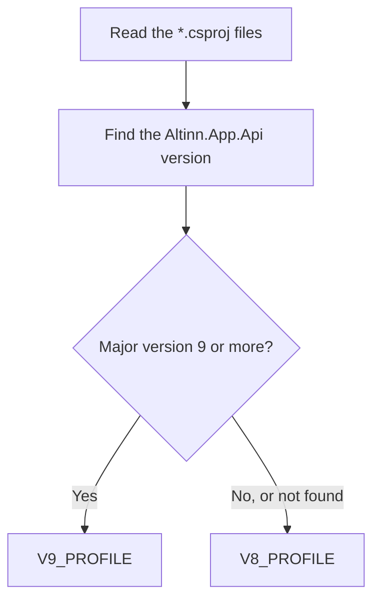
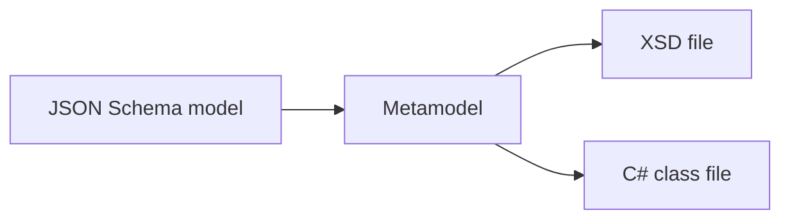

# Altinn domain library

Code: `agents/altinn/app_version/`, `agents/altinn/layout/`, `agents/altinn/resources/`, `agents/altinn/datamodel/`

This library is plain Python with no model calls. The tools call it in the same process. It does four jobs: it finds the app version, validates layouts against the official schema, validates text resources, and converts data models.

_App version detection. It follows the same rule as Designer._

_Data model sync. It uses the same conversion logic as Designer._

A version profile holds the prompt text, the layout schema location and the binding rules for one app version. The v8 layout schema comes from `altinncdn.no`. The v9 schema comes from `src/common/ts/layout-contract` in this repository. The service keeps a loaded schema in memory for 1 hour.
