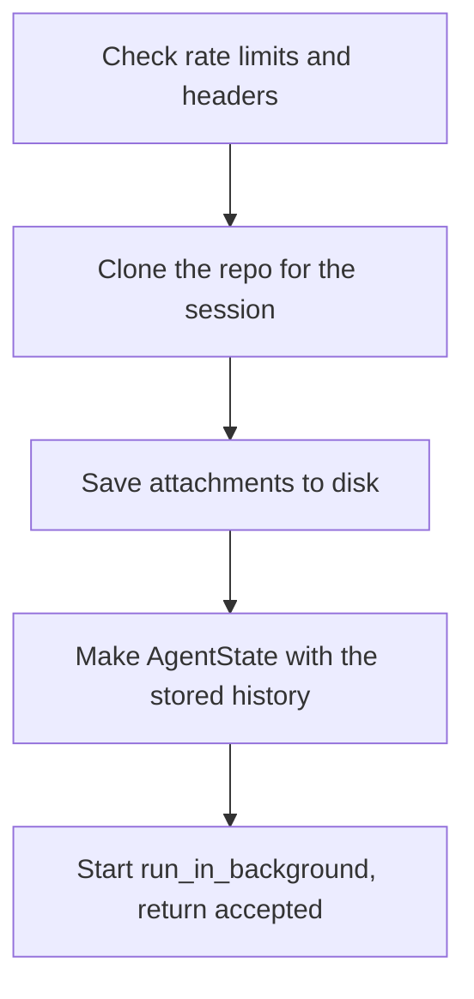
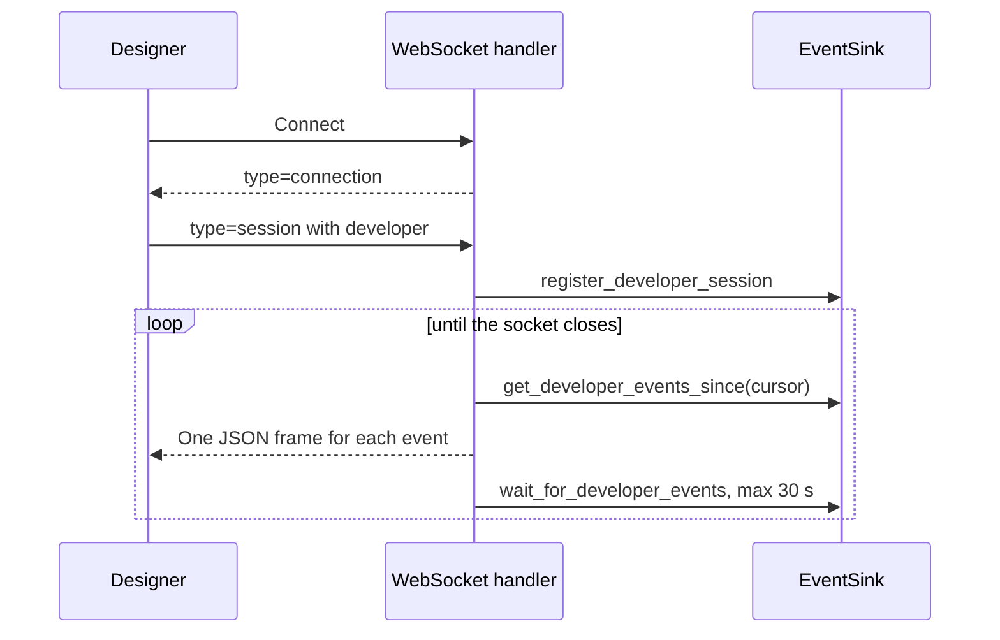

# API layer

Code: `api/main.py`, `api/routes/agent.py`, `api/routes/websocket.py`, `api/rate_limiting.py`

`api/main.py` makes the FastAPI app and adds the routes. At startup it starts Langfuse and gives the event sink a reference to the main event loop. The start route needs two headers: `X-Api-Key` (else 401) and `X-Developer` (else 400). A sliding-window limiter counts starts for each developer and for all developers.

_The steps in `POST /api/agent/start`._

The WebSocket handler does not use callbacks. It pulls events from a buffer with a cursor. It waits on an `asyncio.Event` for new events, for a maximum of 30 seconds each time.

_The `/ws` handler. The cursor starts at the end of the buffer, so old events are not sent again._
