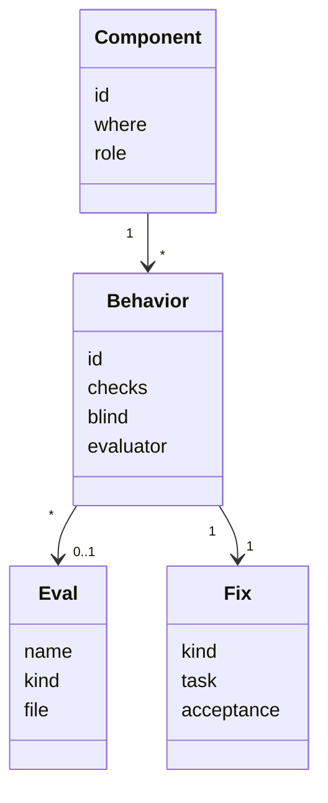
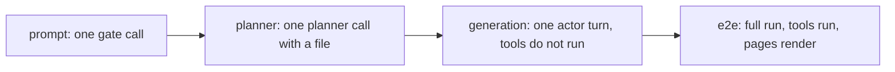
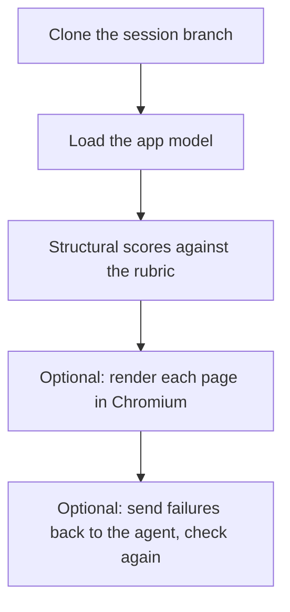
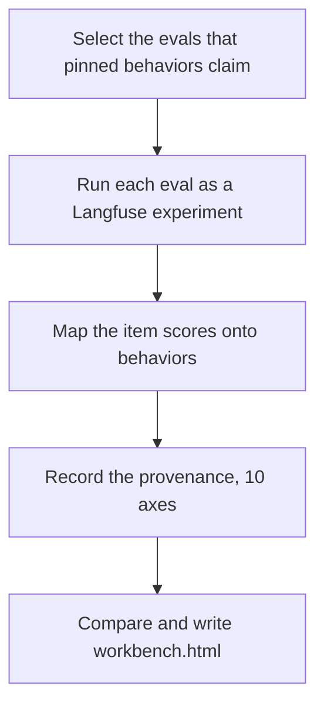
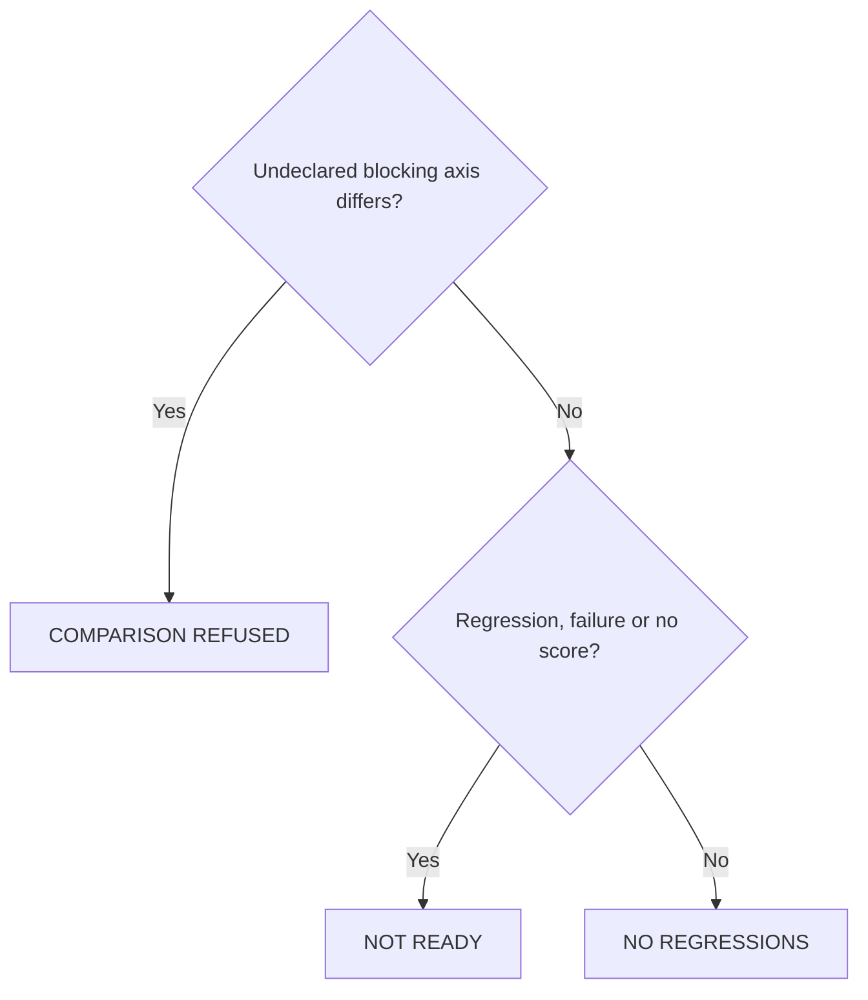
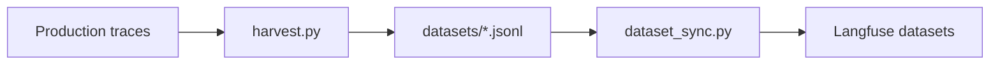
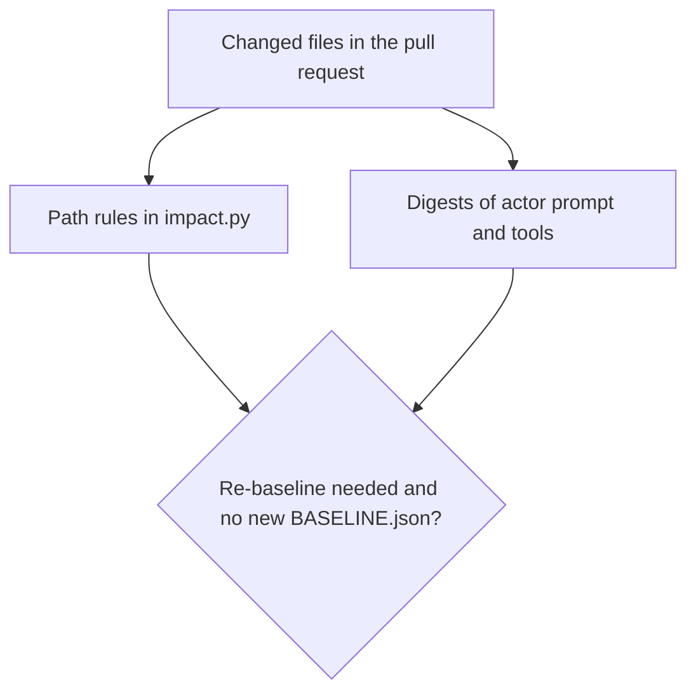

# Benchmarks

Code: `benchmarks/`, `.github/workflows/assistant-evals.yaml`

The workbench answers one question: "I changed something. What did the change do?" It has six parts: the manifest, the evals, the check command, the run history with the baseline, the datasets, and the CI gate.

For how to run it, refer to [benchmarks/EVALS.md](../../benchmarks/EVALS.md). For the end to end benchmark and its prerequisites, refer to [benchmarks/README.md](../../benchmarks/README.md).

## Manifest and registry

Code: `benchmarks/manifest.py`, `benchmarks/registry.py`

`manifest.py` declares what the agent must do, as components and behaviors. A behavior is **pinned** when a dataset and an evaluator score it. A behavior that nothing scores is a **gap**. The report shows the gaps on purpose, so that a person sees what no eval checks. Each behavior also states what its eval cannot see, and a fix task with acceptance criteria. The report turns these into a prompt for a coding agent. `python -m benchmarks.runner behaviors` prints the current list.

_The manifest model. `check` runs only the evals that a pinned behavior claims._

| Eval                         | Kind       | What it runs                                            |
| ---------------------------- | ---------- | ------------------------------------------------------- |
| `Gates/scope`                | prompt     | The scope prompt on one question                        |
| `Gates/intent-safety`        | prompt     | The intent prompt, scored on the safe verdict           |
| `Gates/confidence`           | prompt     | The intent prompt, scored on the side of the 0.30 limit |
| `Planner/intake`             | prompt     | The intake prompt, scored on the intent family          |
| `Planner/spec`               | planner    | The spec prompt on a real PDF                           |
| `Loop/traces`                | generation | One actor turn, replayed from a production trace        |
| `Benchmarks/forms`           | e2e        | A full agent run that builds an app                     |
| `Redteam/indirect-injection` | prompt     | Orphan: the corpus exists, but no runner uses it        |

## Four kinds of eval

Code: `benchmarks/gates.py`, `benchmarks/planner.py`, `benchmarks/generation.py`, `benchmarks/agent_task.py`

The kinds differ in how much of the agent they run. A prompt eval is one model call with no tools. A generation eval replays one decision point: the conversation, the recorded system prompt and the tool list go to the model, but the tools do not run. Only the e2e eval runs tools, pushes a branch and renders pages.

_From the fastest kind to the most complete kind. An e2e item takes minutes. A prompt item takes seconds._

The e2e eval compares the committed app with a structural rubric: the number of pages, the minimum number of input components, the expected field titles and the navigation. The rubric does not list file names, because two correct runs can use different IDs. The browser render check and the render-fix loop are off by default (`BENCH_PREVIEW_CHECK`, `BENCH_RENDER_FIX`).

_How `AgentTask` scores one built app. The committed repository is the ground truth, not the trace._

## The check command

Code: `benchmarks/runner.py`, `benchmarks/check.py`, `benchmarks/report.py`

`check` runs each selected eval as one Langfuse experiment. The e2e eval runs one item at a time. The other evals run up to 5 items at a time. After the scores, a judge model (`LLM_MODEL_EVAL_JUDGE`) reads the evidence and writes a short review. `--no-review` skips this step.

_The steps of `runner check`._

## Provenance, baseline and verdicts

Code: `benchmarks/provenance.py`, `benchmarks/runstore.py`, `benchmarks/diff.py`, `benchmarks/remote.py`

Each run records 10 axes, for example the code commit, the models, the prompt versions and digests of the actor prompt and the tool schemas. Seven axes block a comparison: environment, prompt versions, actor prompt digest, tool schema digest, dataset version, evaluator versions and judge model. If one of them is different and the developer did not declare it with `--under-test`, the comparison stops.

The runs live in Langfuse. The folder `benchmarks/runs/` is only a local cache. The choice of baseline lives in git, in `BASELINE.json`. The reason: to adopt a baseline is a decision, and a decision must be in a reviewed commit. A score change smaller than 0.02 is noise. The report also shows when an output changed but the score did not.

_The main verdicts. Two more exist: NOT ADOPTABLE (a pinned behavior got no score) and "No baseline"._

## Datasets and harvest

Code: `benchmarks/datasets/`, `benchmarks/dataset_sync.py`, `benchmarks/harvest.py`

The items are JSONL files in the repository, so a reviewer can read each case in a diff. Each item must have a note that tells why the case exists. `dataset_sync` copies the files to the Langfuse datasets. An experiment runs the Langfuse copy, and the runner warns when the two have a different number of items. Nobody writes `loop_traces.jsonl` by hand. `harvest.py` makes it from production traces. The e2e items and their rubrics live only in Langfuse.

_Where the items come from. `harvest.py` makes the loop items and the intake items from real runs._

## CI impact gate

Code: `benchmarks/impact.py`, `.github/workflows/assistant-evals.yaml`

`impact.py` declares which files move which axis. A change to a dataset, an evaluator or a prompt in `agents/prompts` needs a new baseline. A change to other code in `agents/core` or `agents/services` does not, because the old baseline is still a valid comparison. The exception is a change to the actor prompt or the tool schemas. The gate computes digests of both and compares them with `BASELINE.json`. A change to only comments, formatting, or module and function docstrings moves no axis. Developers can run the same check before they push: `python -m benchmarks.runner impact`.

_The gate fails on "yes". It never runs the bench and needs no secrets._
