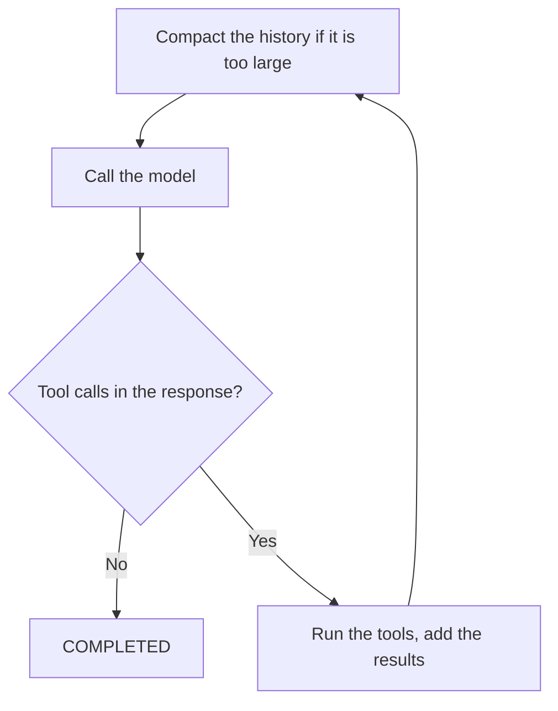
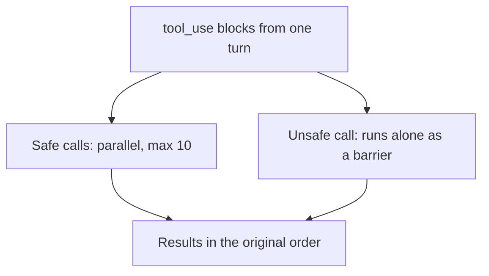
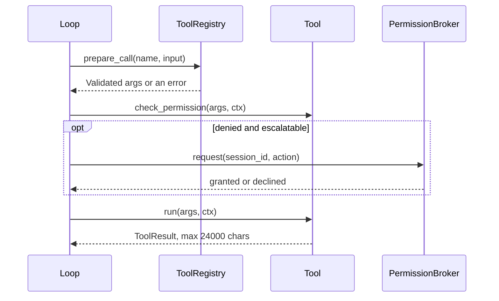
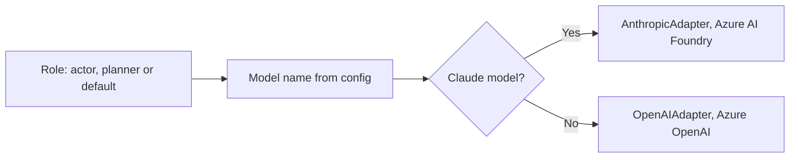

# Core loop and model adapters

Code: `agents/core/loop.py`, `agents/core/compaction.py`, `agents/core/messages.py`, `agents/core/llm_adapter.py`, `agents/services/llm/llm_client.py`, `shared/config/base_config.py`

## The loop

`run_loop` is the only place that decides what happens next. Each turn sends the messages to the model. If the response has no tool calls and the model did not stop at the token limit, the loop stops with `COMPLETED`. If it has tool calls, the loop runs the tools and adds the results as a new user message.

_One turn of the loop._

The loop has five end states:

| Reason      | When                                                                                          |
| ----------- | --------------------------------------------------------------------------------------------- |
| `COMPLETED` | The model sends text with no tool calls.                                                      |
| `MAX_TURNS` | The loop used all its turns (`AGENTIC_LOOP_MAX_TURNS`).                                       |
| `STUCK`     | The model sent the same tool call with the same input 3 times in 5 turns.                     |
| `CANCELLED` | The user cancelled. The loop checks this at the start of each turn and after each model call. |
| `ERROR`     | The model call failed, or the output was cut at the token limit 3 times in a row.             |

Tool errors do not stop the loop. A bad argument, a refusal or an exception becomes an error result. The model reads it and tries again.

_Tool dispatch. Reads run in parallel. Writes run one at a time._

_One tool call. Each call also gets a Langfuse span._

Compaction does not change the stored history. It makes a smaller copy for the next model call. It keeps the first message (the goal) and the last 6 messages, and replaces the middle with a short digest.

## Model adapters

The service uses three model roles. The **actor** runs the loop. The **planner** runs intake and spec. The **default** role runs the gates. The model name decides the provider. A Claude model goes to Azure AI Foundry. Other models go to Azure OpenAI.

_Provider selection. The loop uses `build_adapter`. The other steps use `LLMClient`._

The default model of each role is in `shared/config/base_config.py`. Environment variables can change each one. `GET /health` shows the model of each role. The messages inside the loop use the Anthropic shape (text, tool_use and tool_result blocks). The OpenAI adapter translates them. Only the Anthropic adapter streams. With a Claude actor, the user sees text and tool placeholders before the turn ends. The OpenAI adapter does not stream, so the text of each turn comes when the turn ends.
