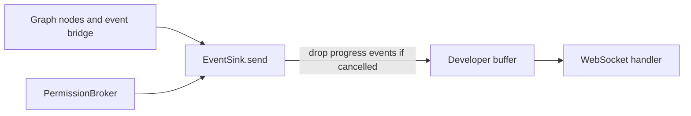
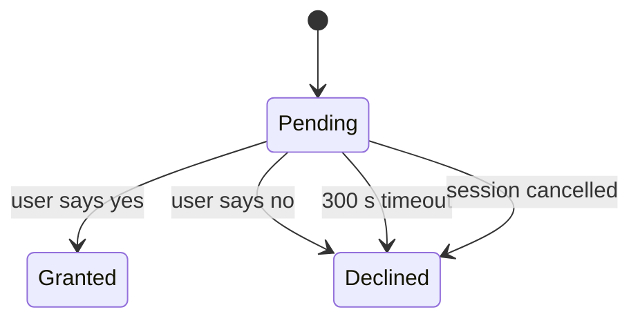

# Events and permissions

Code: `agents/services/events/jobs.py`, `agents/services/events/permissions.py`, `agents/services/events/events.py`

## Event sink

`EventSink` is the central event bus. It keeps one buffer for each developer, the status of each session, the conversation history and the set of cancelled sessions. Locks make it safe for threads. After a cancel, it drops progress events (status, chunk, permission, plan), so the frontend does not show a run as active.

_Event producers and the consumer._

## Permission broker

`PermissionBroker` sends one prompt for each session. If the model sends many write calls in one turn, they all share the same prompt and the same answer. After a "no", the loop refuses all write tools for the rest of the run.

_The states of one permission prompt._
