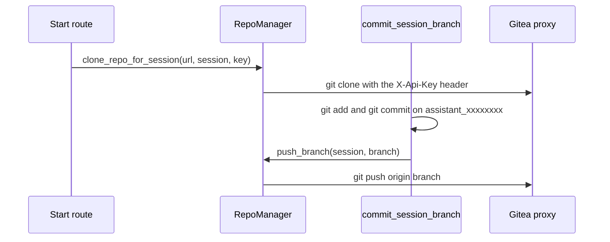

# Git and repo

Code: `agents/services/git/repo_manager.py`, `agents/services/git/git_ops.py`, `agents/services/repo/repo_discovery.py`

`RepoManager` clones the app into a temporary folder for each session. It replaces the host in the repo URL with `GITEA_BASE_URL`. It adds the API key as an HTTP header for each git command. It does not write the key into the git configuration. The clone starts on the branch that the user has open in Designer. The first commit makes the session branch from there.

_Clone at start, commit and push during the loop. A push failure does not undo the local commit._

`repo_discovery.py` scans the clone for `scan_repo`. It finds layout files, model files, text resource files and locales.
