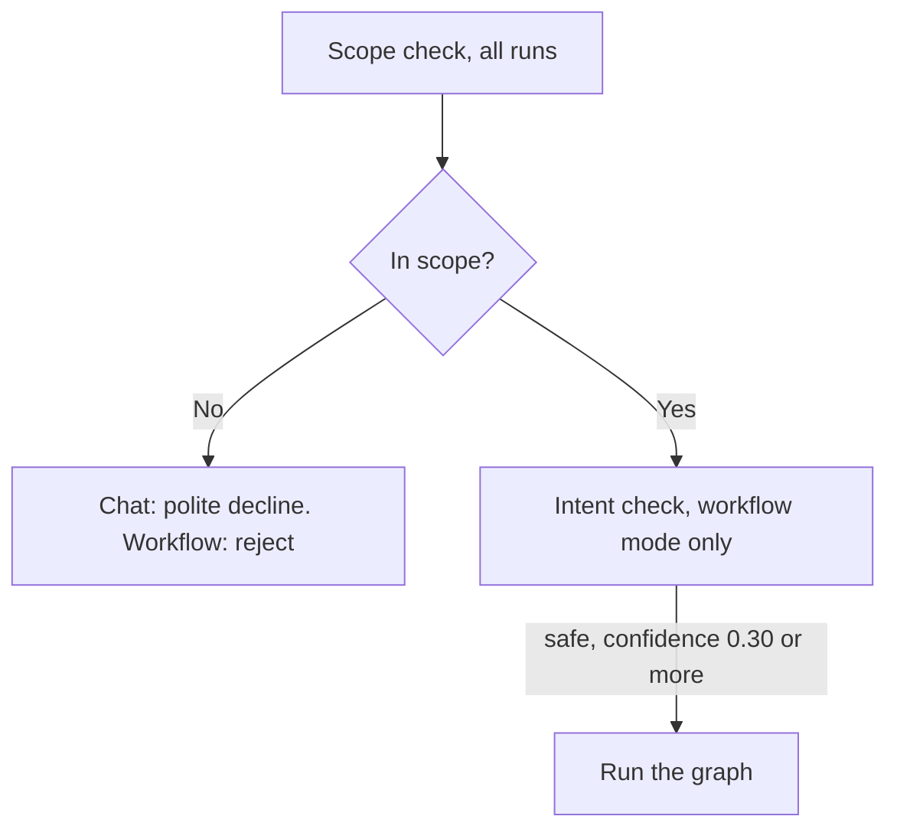
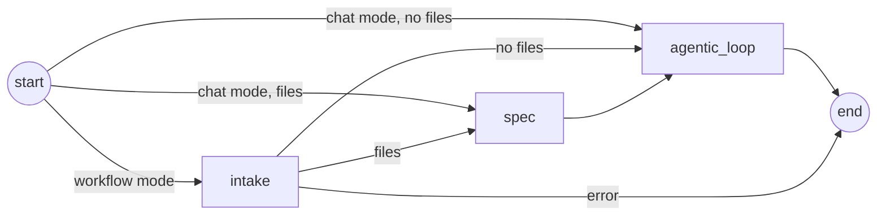
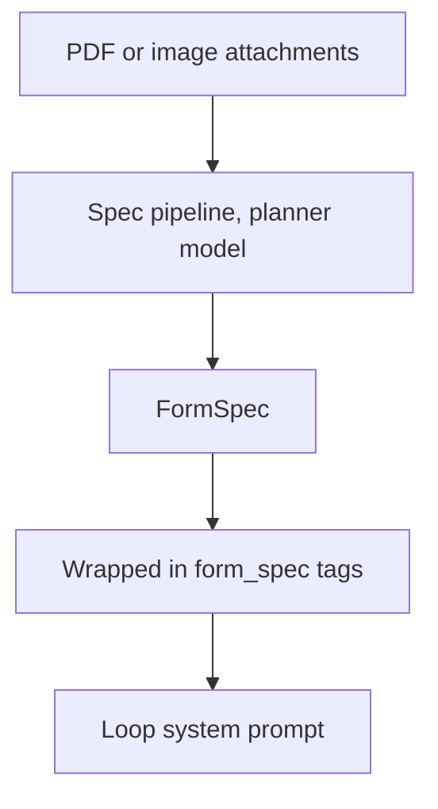
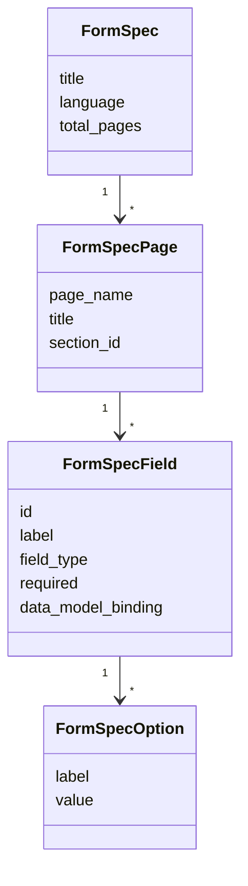
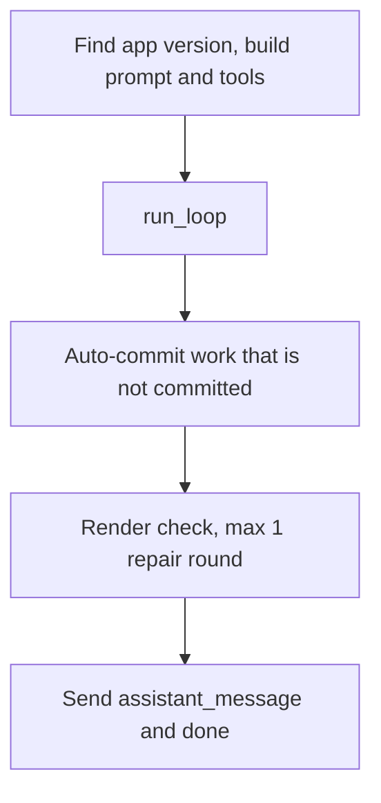
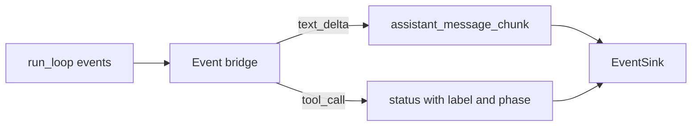

# Graph: gates, intake, spec and the loop node

Code: `agents/graph/`, `agents/workflows/`, `agents/services/llm/scope_checker.py`, `agents/services/llm/intent_parser.py`

## Runner and gates

`run_once` in `agents/graph/runner.py` opens one Langfuse root span for the run. Then it runs two gates before the graph. The scope check runs for all requests. The intent check runs only in workflow mode. The scope check fails open: if the model call fails, the request continues. The intent check fails closed: if it cannot run, a write request stops.

_The gates. An unsafe or unclear goal stops with `GoalRejected` and gets suggestions._

_The LangGraph graph. Each node first checks if the user cancelled the session._

## Intake and spec

**Intake** runs only in workflow mode. One call to the planner model writes a short plan from the goal and the last 6 messages. Intake sends only the names of the attachments, not the content. The plan goes to the user as a `plan_proposed` event. No later step reads the plan.

**Spec** runs when the request has attachments. One call to the planner model reads the PDF or image and returns a `FormSpec`. This call can take 20 to 90 seconds. If spec fails, the run continues. The loop then gets an instruction to ask the user for the field list.

_From a document to the loop._

_The shape of a `FormSpec`, in `agents/graph/state.py`._

## Agentic loop node

Code: `agents/graph/nodes/agentic_loop_node.py`

This node prepares the loop and handles the result. It finds the app version (v8 or v9), builds the system prompt and registers the tools. In chat mode it connects the permission broker, so a write tool can ask the user.

After the loop, workflow mode has two safety steps. If the model changed files but did not commit, the node verifies and commits the files. If the commit exists, the node runs the render check. On a failure, it gives the error to the model for one more loop run.

_The node steps. Steps C and D run only in workflow mode._

An event bridge changes loop events into events for the user. It sends model text at most once each 100 ms. It changes tool calls into Norwegian status lines with a phase: reading, writing, verifying, committing or thinking.

_The event bridge. A `tool_use_id` lets the frontend replace a placeholder line in place._

The final message also gets two flags. `no_branch_operations` tells Designer not to check out a branch in chat mode. `attachmentInstructionFlagged` tells Designer to show the injection warning.
