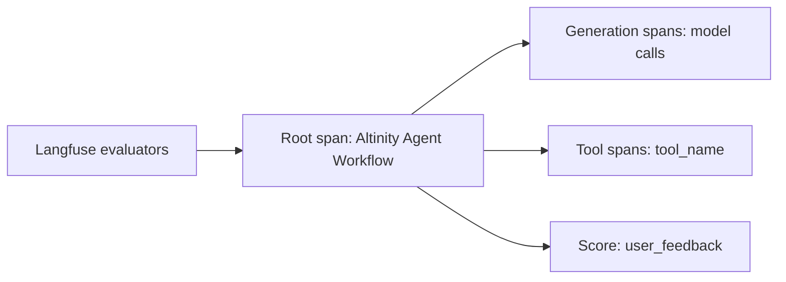

# Traces and usage

Code: `shared/utils/langfuse_utils.py`, `api/routes/traces.py`, `api/routes/token_usage.py`, `services/traces/`, `services/token_usage/`, `agents/prompts/llm-as-a-judge/`

Each run makes one Langfuse trace. The root span is "Altinity Agent Workflow". Model calls and tool calls are child spans. The output of the root span holds the summary, the changed files, the sources and the commit hash.

Four LLM-as-a-judge evaluators in Langfuse score this output: `intent_match`, `no_hallucination`, `faithful_summary` and `no_irrelevant_responses`. Their reviewed source is in `agents/prompts/llm-as-a-judge/`. This is the online evaluation. The [benchmark](benchmarks.md) is the offline evaluation.

_The shape of one trace._

A thumbs up or down from the user becomes the score `user_feedback` on the trace. Only the developer who owns the trace can set it. A nightly Designer job calls `POST /api/traces/delete-expired`, which deletes traces older than the retention period (`LANGFUSE_TRACE_RETENTION_DAYS`). `GET /api/token-usage/daily` returns the tokens of the day before, for each service owner, in a billing format.
