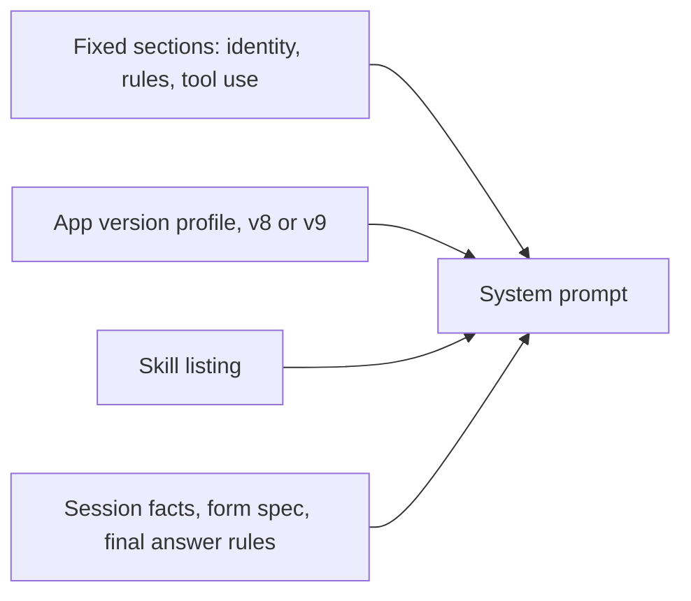
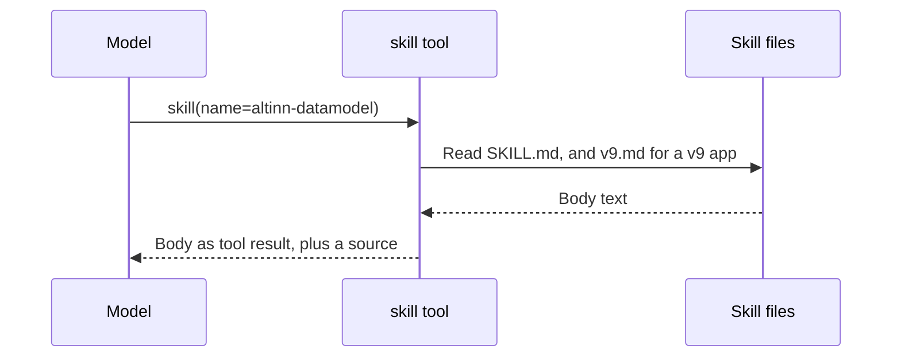
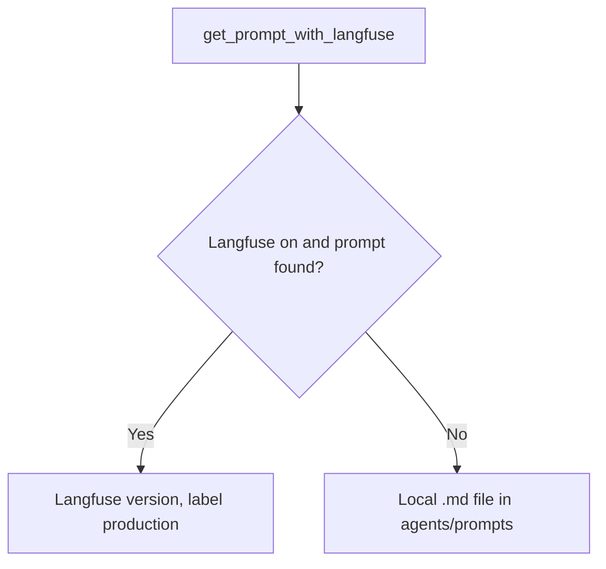

# Prompt and skills

Code: `agents/core/context.py`, `agents/core/skills.py`, `agents/skills/`, `agents/prompts/`, `scripts/sync_prompts.py`

## The loop system prompt

The system prompt of the loop is built in code, from fixed sections and session facts. It explains the four parts of an Altinn app: layouts, data models, text resources and policy. It also lists rules that models often break.

_The parts of the loop system prompt. The final answer rules are different for chat mode and workflow mode._

## Skills

Skills use progressive disclosure. The prompt has only the name and a short description of each skill. The model calls the `skill` tool to get the full text. If the app is v9, a `v9.md` file adds version-specific text. Each folder in `agents/skills/` is one skill.

_A skill load. The source becomes a link chip under the final answer._

## Prompts for the gates, intake and spec

_Prompt loading. The CI workflow `assistant-prompts.yaml` publishes a changed prompt after the merge to main._

One prompt file has a different name in Langfuse: `intent_security.md` is published as `intent_check` (`SERVED_FROM` in `scripts/sync_prompts.py`).

For publication, drift and retired prompts, refer to [agents/prompts/README.md](../../agents/prompts/README.md).
