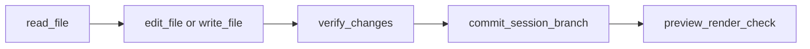
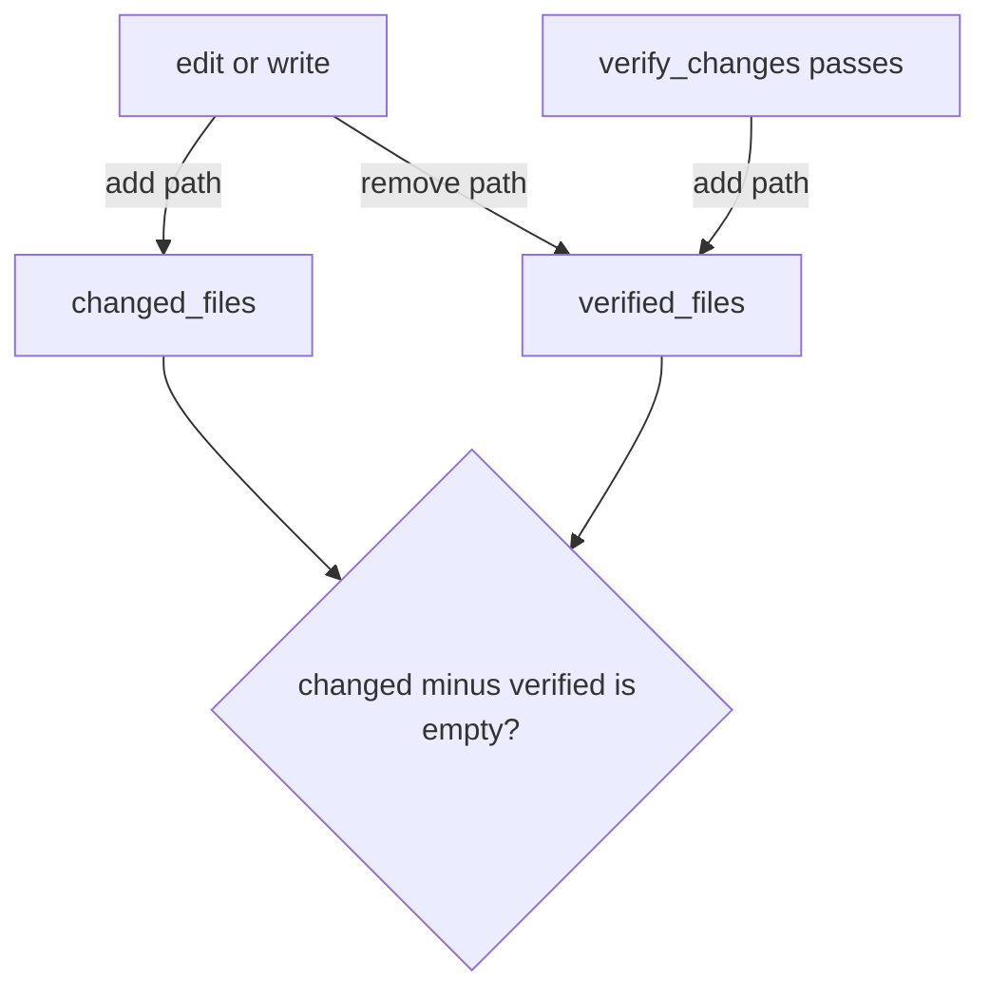
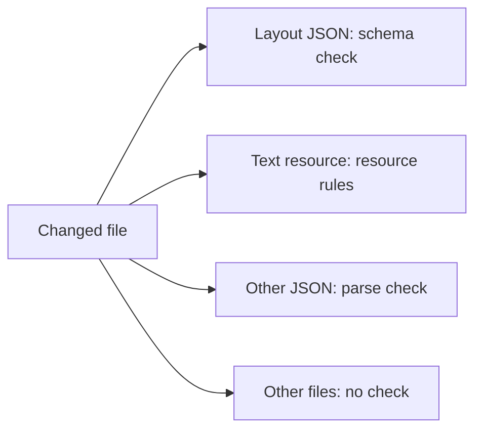

# Tools

Code: `agents/core/tool.py`, `agents/core/registry.py`, `agents/core/tools/`

Each tool is a class with a name, a description, a Pydantic input schema and a `run` method. A tool that changes the app inherits `WriteToolMixin`. This mixin refuses the call when the session is read-only, and marks the refusal as one the user can lift. The loop node registers the tools in `_internal_tools()` in `agents/graph/nodes/agentic_loop_node.py`.

| Tool                    | Job                                              | Parallel | Needs write mode |
| ----------------------- | ------------------------------------------------ | -------- | ---------------- |
| `scan_repo`             | List layouts, models, text resources and locales | Yes      | No               |
| `read_file`             | Read one file, max 60 000 chars                  | Yes      | No               |
| `edit_file`             | Replace one string in one file                   | No       | Yes              |
| `write_file`            | Make or replace a whole file                     | No       | Yes              |
| `discard_file_changes`  | Reset one file to HEAD                           | No       | Yes              |
| `verify_changes`        | Validate all changed files                       | Yes      | Yes              |
| `commit_session_branch` | Commit and push to the session branch            | No       | Yes              |
| `preview_render_check`  | Render each page in a headless browser           | No       | Yes              |
| `skill`                 | Load the full text of one skill                  | Yes      | No               |
| `altinn_layout_props`   | Get the allowed properties of a component type   | Yes      | No               |
| `altinn_datamodel_sync` | Make XSD and C# from a JSON Schema model         | No       | No               |
| `web_fetch`             | Get a page from the Altinn docs hosts only       | Yes      | No               |

There is no automatic rollback. The model undoes a change with `discard_file_changes`, one file at a time. The file tools refuse absolute paths and `..`, so the model cannot leave the repository. `edit_file` and `write_file` refuse to change an existing file that the model did not read first. `preview_render_check` is off by default (`PREVIEW_CHECK_ENABLED=false`) and works only with the local Designer stack.

_The usual write path. The system prompt tells the model to follow it._

_The commit gate. The commit tool refuses if a changed file is not verified after its last edit._

_How `verify_changes` picks a validator. It also checks text keys and page navigation._
