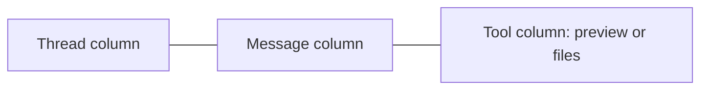
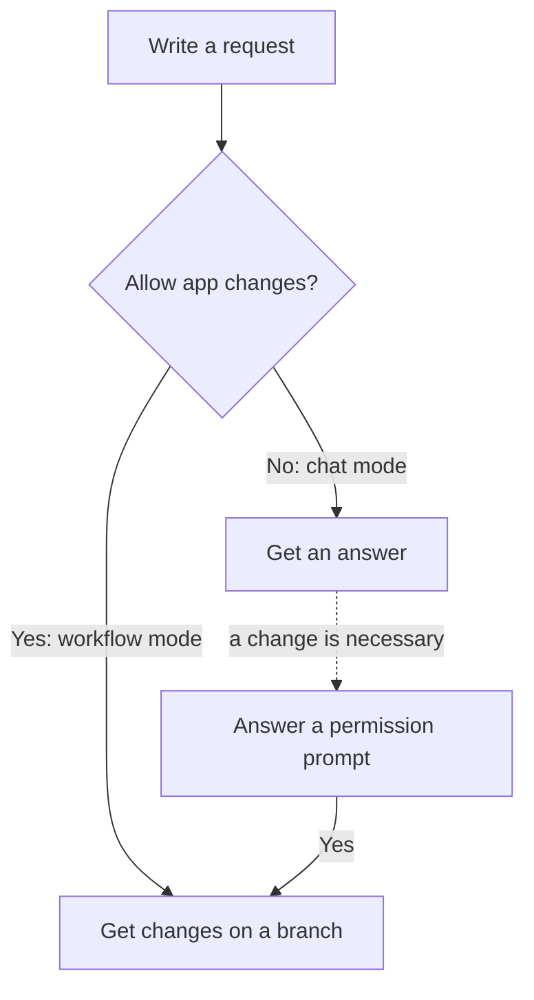
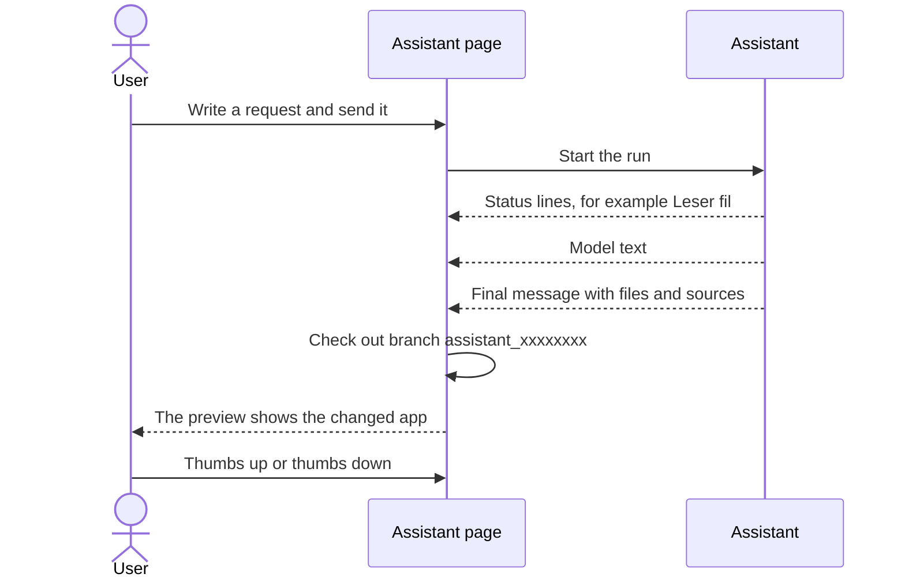
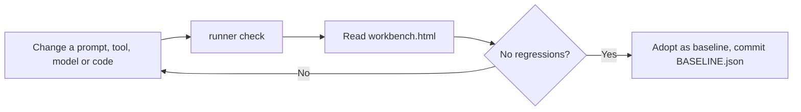

# Level 1: User view

_How does the user see and use the service?_

The user does not see the assistant service directly. The user opens the assistant page of an app in Altinn Studio Designer. During the beta, only selected service owners get access. A backend check (`CanUseAiAssistantEvaluator`) controls this list.

The page has three columns:

- **Threads** ("Tråder"). Each thread is one conversation. The thread id is also the session id in the assistant service.
- **Messages**. The user writes a request here. The user can attach PDF files or images, for example a paper form.
- **Tool column**. It shows a preview of the app, or a file browser.

_The three columns of the assistant page._

Under the input field there is a switch: "Tillat endringer i appen" (allow changes in the app). The switch selects one of two modes:

- **Switch off: chat mode.** The assistant answers questions about Altinn and about the app. It does not change files. If an answer needs a change, the assistant shows a permission prompt in the chat. If the user accepts, the session changes to workflow mode.
- **Switch on: workflow mode.** The assistant changes the app files. It validates the changes and commits them to a new branch with the name `assistant_` + 8 characters of the thread id.

_The two modes, and the permission prompt that connects them._

While the assistant works, the user sees an activity trail. Each line is a short Norwegian status, for example "Leser App/ui/form/layouts/Side1.json" or "Validerer endringer". The model text also appears in the chat. The user can stop the run at any time.

At the end, the user gets a final message. It lists the changed files and the sources that the assistant used. Designer then checks out the session branch, so that the preview shows the changed app. The user can give a thumbs up or a thumbs down on each answer.

_One run, as the user sees it._

Some requests do not give changes:

- A question that is not about Altinn app development gets a polite decline.
- In workflow mode, an unsafe or unclear request gets a rejection, with suggestions for a better request.
- If an uploaded document contains instructions to the assistant, the user gets a warning. The assistant does not obey these instructions.

## A second user: the assistant developer

The developers of the assistant use a different interface: the benchmark workbench in a terminal. They run it after they change a prompt, a tool, a model or the loop code. One command runs the evals, compares the result with the accepted baseline and writes a report page, `benchmarks/reports/workbench.html`.

The command `python -m benchmarks.runner` without arguments shows a menu of all commands. The usual command is `python -m benchmarks.runner check --label "what changed"`. The slow end to end builds run only with `--include-e2e`.

_The developer loop. The new baseline goes into the same pull request as the change._
