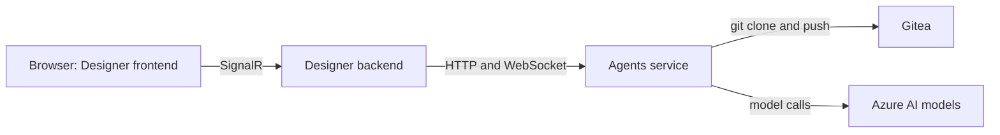
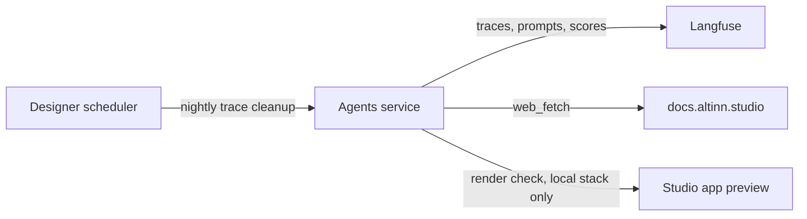
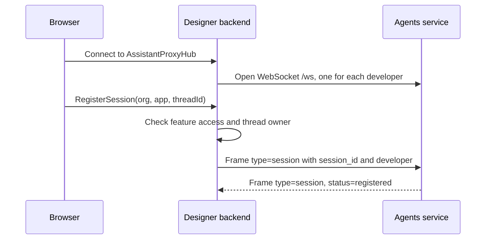
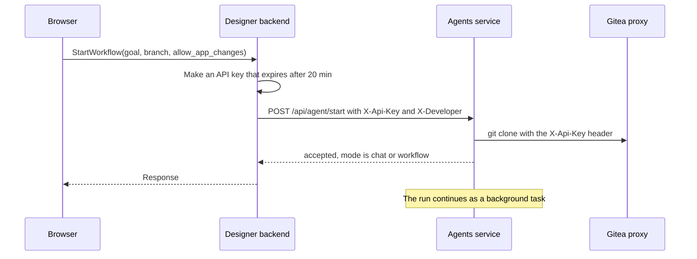
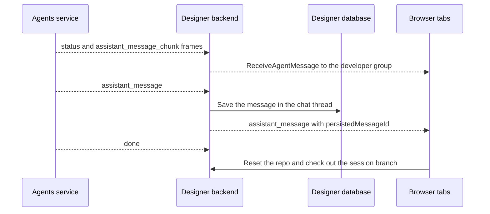
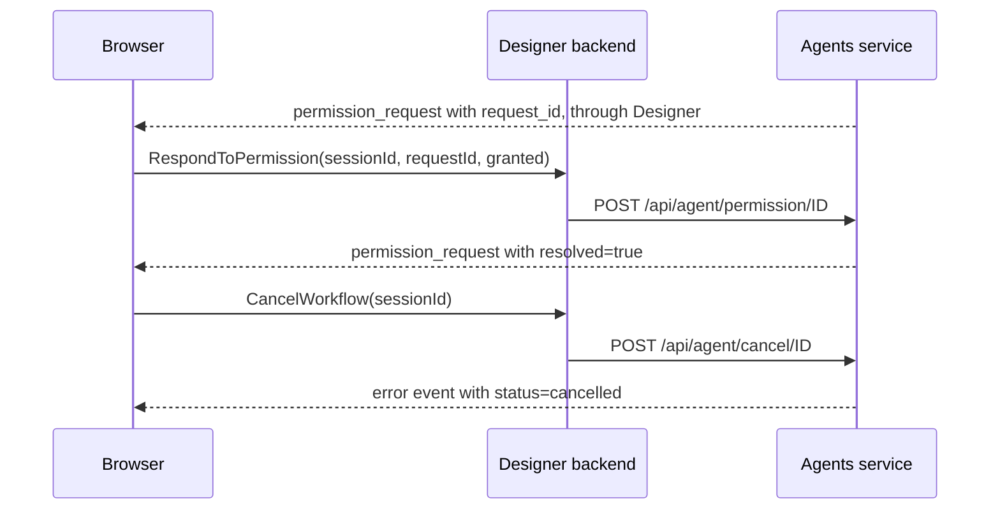
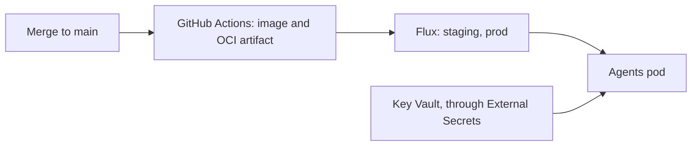
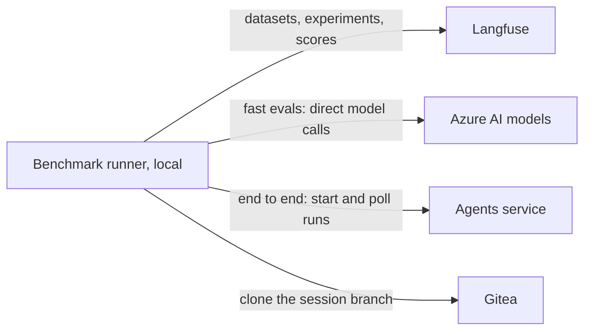
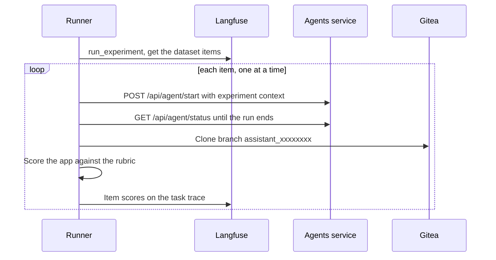
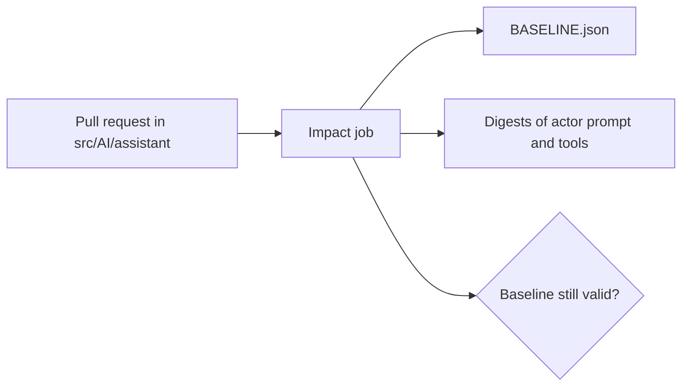

# Level 2: System context

_How is the service connected with other services?_

Designer code:

- `src/Designer/backend/src/Designer/Hubs/Assistant/`
- `src/Designer/backend/src/Designer/Services/Implementation/Assistant/`
- `src/Designer/frontend/app-development/features/aiAssistant/`
- `src/Designer/frontend/libs/studio-assistant/`

The browser never calls the agents service. The Designer backend is between them. The browser talks to Designer through SignalR (`AssistantProxyHub`). Designer talks to the agents service through HTTP for commands and through one WebSocket for events. In Kubernetes, the agents service is the internal service `altinn-altinity-agents`. It listens on port 80 and sends traffic to the container on port 8071.

_The main path. Gitea holds the app repositories. Azure OpenAI and Azure AI Foundry host the models._

_Support services. Langfuse is optional. Without it, the service records no traces and uses local prompt files._

## Connect and register a thread

Designer opens one WebSocket to the agents service for each developer. This socket stays open when the user reloads the page. Thus a run continues to send events after a page reload.

_Connection setup. The agents service sends events by developer, not by tab._

## Start a run

Designer makes a short-lived API key for each run. The key expires after 20 minutes. The agents service uses this key to clone and push through the Gitea proxy. The service has no Gitea token of its own.

Attachments go to Designer first. Designer accepts eight file types up to 20 MB each and keeps them in memory for a maximum of 30 minutes. Then it sends them as base64 in the start request.

_The start request returns quickly. The real work happens after the response._

## Events come back

The agents service pushes events on the WebSocket. Designer sends each event to the SignalR group of the developer, so all open tabs get it. Designer also saves the final answer in its own database. This step makes sure that the answer is not lost when no tab is open.

_Event flow from the agents service to the user._

## Permission prompt and cancel

In chat mode, the first write tool call stops the loop and sends a `permission_request` event. The loop waits for the answer for a maximum of 300 seconds. No answer counts as "no". A cancel request sets a flag. The loop reads the flag at the start of each turn.

_Two user actions during a run. The agents service checks that the caller owns the session._

## Deploy

A merge to main that changes `src/AI/assistant` goes to staging and production. The workflow `deploy-studio-ai-agents.yaml` builds the image, publishes the manifests as an OCI artifact and tags the artifact for each environment. Flux then does the rollout.

The pod gets five secrets from Key Vault: the Azure key and four Langfuse values. The model names are not in the manifest, so they come from the defaults in code.

_The deploy path. A change to the code goes to production in a few minutes._

## The benchmark workbench

The benchmark runner is a local command line tool. It does not run in production. Most evals call the models directly with the production prompts, without the agents service. Only the end to end eval starts real runs on a local agents service, through the same `/api/agent/start` route that Designer uses.

_What the runner connects to. Langfuse holds the dataset items and the results of each run._

An end to end item makes two traces in Langfuse. The runner trace has the scores. The agent trace has the model calls. The runner sends an `experiment` object in the start request, and the agent puts it on its trace. This connects the two traces.

_One end to end eval. The items run one at a time, because each run pushes to the same test repository._

GitHub Actions does not run the benchmark. The workflow `assistant-evals.yaml` only checks if a pull request makes the current baseline invalid. Scores change between runs, and a run costs money and needs secrets. For these reasons, the bench is a local command.

_The CI gate. It fails when a change moves what the bench measures and the pull request has no new `BASELINE.json`._
