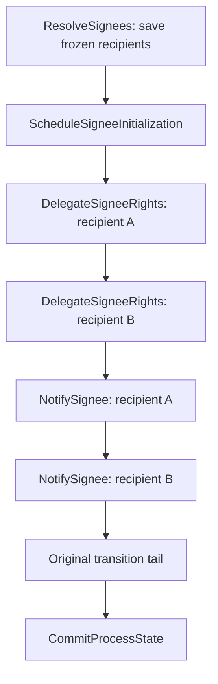

# Per-signee signing initialization experiment

This experiment moves runtime delegated signing from one bulk command into stable ordinary workflow commands with
recipient-level boundaries. It builds on the ordinary process-task command API from the bulk signing branch and uses current main’s versioned
aggregate writes and process-status ownership. The bulk implementation remains on `feat/robust-signee-initialization`.

## Scope and topology

`SigningProcessTask` declares `ResolveSignees` and `ScheduleSigneeInitialization` when runtime delegation is
configured. Resolution stores the frozen recipient list and opaque recipient IDs in the task's signee-state data.
The scheduler creates a dependent continuation containing one `DelegateSigneeRights` command for each recipient,
then one `NotifySignee` command for each recipient, followed by the original transition tail and its existing
`CommitProcessState` step. Signing remains in initialization until these steps complete.

The preparation and continuation workflows are sequential and remain under the process engine's normal processing
ownership. There are no per-instance leases and no separate notification workflows.

Each ordinary command receives a stable key and a serialized per-task payload. The task ID comes from that payload,
not from ambient current-task state. The scheduler preserves the original transition labels and carries the remaining
commands into the dependent continuation. A continuation is created only after preparation succeeds, so preparation
is never repeated as part of the transferred tail.

## Retry and state

A successful delegation mutates the aggregate before the next recipient command runs. A retry therefore starts at
the failed recipient and does not repeat completed grants. The engine owns workflow status, retry counts, backoff,
and terminal errors. Storage owns successful delegation and notification facts and the frozen identities from which external notification keys are derived.

External operations are at-least-once. Access Management and Correspondence must tolerate a repeated request after a
response or callback save is lost. A stable task-entry and recipient identity is used to derive notification keys.
The process engine serializes active work. Process ownership remains `Processing` through retries and failures,
so another transition cannot change the shared state before `CommitProcessState` releases ownership. No instance
lease is acquired.

Small, configured signing and payment state documents travel in the signed callback snapshot with their exact blob
versions. This lets a retry read its original input even after an accepted write loses its response, then reach
Storage’s aggregate replay handling. PDFs and arbitrary attachments are not copied into this snapshot.

The signee provider can run again when the resolve step itself retries. If the first attempt already saved a list,
Storage replays that mutation and retains the original recipients and IDs. Downstream recipient retries do not run
the provider again.

Notifications are ordinary per-recipient commands in the same sequential continuation. A notification failure holds
the signing initialization workflow and is recovered with the existing process workflow resume operation. There is no
`signing/notifications` inspection or resume API in this experiment. The frontend shows the ordinary
processing/failure screen until initialization commits. A failed transition has no citizen retry button;
recovery uses the existing authorized process resume operation, followed by a refresh. Failure-code
fields in stored legacy signee state remain readable, but failed recipient attempts in this topology
are recorded by the engine and do not save their pending signee-state changes.

A failed delegation or notification must be corrected before resuming the process workflow. Known permanent errors
fail without automatic retry; transport failures, timeouts, 408/429, and 5xx responses receive the configured bounded
retry policy. Dependency response text is mapped to the command result and is not exposed as an engine error contract.

## Compatibility and trade-offs

The recipient list remains in the configured signee-state data type. Existing pre-engine signing instances retain
their stored signing data and continue through the legacy compatibility path. Previously enqueued experimental
workflow shapes are not migrated.

The continuation must fit the engine's configured `MaxStepsPerWorkflow` (default 50). Its size is the number of
recipients plus the original remaining transition commands and the notification commands. Recipient lists larger
than that limit require a future continuation-splitting design; recipients are never silently truncated.

The benefit is isolated retry and durable progress per recipient while keeping all process work in the engine's normal
workflow ownership. The cost is additional workflow steps and longer initialization for larger recipient lists.

## Test matrix

The focused signing tests cover:

- one delegation command per recipient and one notification command per recipient;
- transient delegation failure and retry without repeating successful recipients;
- transient and permanent notification failures with stable idempotency keys;
- workflow resume after a failed delegation or exhausted notification retry;
- task-exit and re-entry behavior, including stale task-entry protection;
- lost external responses and recovery from facts already saved in Storage;
- legacy pre-engine instances completing and rejecting without initialization.

Current-main port testing is in progress. Final readiness and validation results belong in the change review after that
port is complete.
