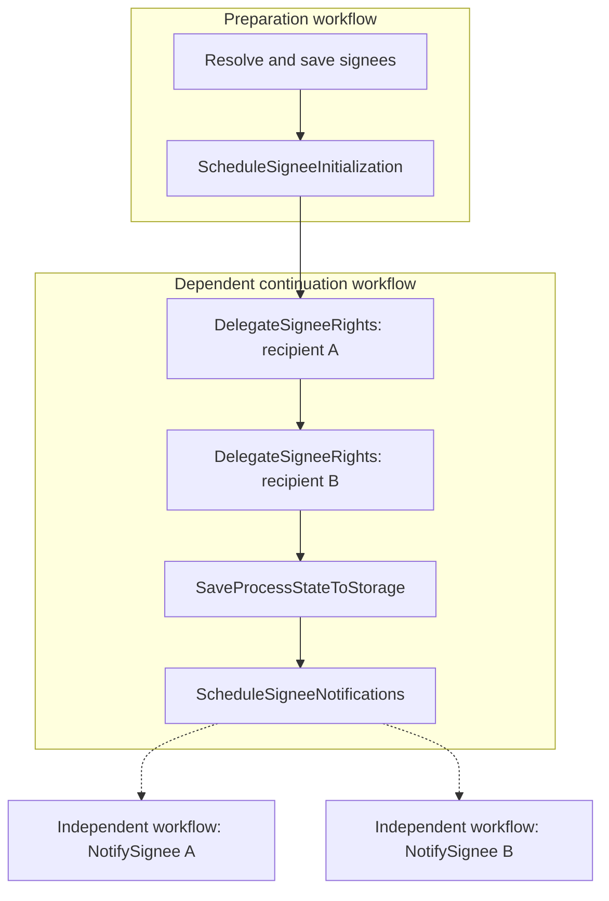

# Per-signee signing initialization experiment

This branch experiments with recipient-level retry boundaries. The tested bulk implementation remains
on `feat/robust-signee-initialization`. The public `IProcessTask` and `IWorkflowEngineCommand` contracts
are unchanged; no workflow-engine service changes are required.

## Execution

`SigningProcessTask` declares `ResolveSignees` and `ScheduleSigneeInitialization` when runtime
delegation is configured. Resolution saves the recipient list, including opaque recipient IDs. The
signee-state data element ID identifies this particular task entry, including when the same task is
entered again later.

The process request factory ends the preparation workflow at the scheduling command and puts the
original remaining transition steps in its payload. Execution options are resolved and frozen before
enqueue. After resolution succeeds, the scheduler creates a dependent continuation with one ordinary
`DelegateSigneeRights` step per recipient, followed by the original transition tail. It inserts
`ScheduleSigneeNotifications` immediately after `SaveProcessStateToStorage`.



The engine cannot insert steps into a running workflow. The continuation is a separate workflow in
the same collection, depends on successful preparation, and carries the published signed state and
original transition labels. The preparation never also executes the transferred tail.

Notification workflows have `IsHead=false` and no execution dependencies. Each is linked to the
continuation, has its own recipient labels, and does not block process progress or another recipient's
notification. Enqueue requests use stable keys and frozen bodies: a lost or partially successful
scheduling response can safely be retried. Notification scheduling uses bounded concurrency.

## State and locking

Delegation is sequential. A successful recipient's state is saved before the engine starts the next
recipient, so retrying recipient B does not call Access Management again for completed recipient A.

The signee list remains in the existing configured data type; applications do not need to increase
its maximum count or add another data type. Notification callbacks acquire their own instance lease
instead of reusing the originating transition's token. They hold it through the fresh Storage read,
send, and data save. Each reads and merges the current list, preserving successful sibling outcomes.
Lock contention defers the callback without consuming notification retries. No lease is held during
backoff. The command key determines this policy so command decorators retain it.

Before sending, the command verifies that the task is still current and that its exact signee-state
element still exists. A notification from an exited or superseded task entry fails as obsolete without
sending or recreating state. The lease serializes this check and send with task exit.

Accepted notification facts and correspondence IDs remain in Storage after engine history expires.
Retry counts and execution failures are owned by the engine. The signing read endpoint projects
terminal notification failures while retaining the persisted status for pre-engine instances. If the
engine is temporarily unavailable, this read still returns the durable signing facts; the service-owner
notification endpoint continues to report that its job status could not be read.

External operations still require idempotency: a dependency may accept an operation before its response
or the callback save is lost. Notification keys derive from the task-entry and recipient IDs, so they
survive retries and resumes. Access Management must tolerate repeating the same grant for the one
recipient whose attempt did not finish.

## Failure and recovery

- Transport failures, timeouts, HTTP 408/429/5xx, and unclassified errors receive bounded retries.
- Known configuration errors, contract violations, and permanent dependency rejections fail the step
  without automatic retries. Correct the cause before resuming.
- Callback cancellation propagates. A documented Correspondence idempotency conflict means the send
  already succeeded.
- A failed delegation blocks task initialization and is resumed through the existing `process/resume`.
- A failed notification does not block signing. It is recovered separately from process workflows.

Service owners can inspect the current signing entry with:

```http
GET /{org}/{app}/instances/{partyId}/{instanceGuid}/signing/notifications
POST /{org}/{app}/instances/{partyId}/{instanceGuid}/signing/notifications/{workflowId}/resume
```

The list contains `workflowId`, `signeeId`, `partyId`, `status`, `retryCount`, and a safe `errorCode`.
`NotificationRetryExhausted` identifies terminal transient HTTP failures whose retry allowance is spent;
`NotificationFailed` covers other terminal failures. The engine marks its final error as no longer
retryable even when retries were exhausted, so this projection also checks the final HTTP status. Dependency response text is not exposed.
Resume returns 202 for an accepted request, 404 for a job outside the current entry, and 409 when the
job cannot be resumed. Both endpoints require the matching service-owner identity and Storage access.
Resume restarts the selected workflow; it does not generate new notification identities or re-delegate
other recipients. The workflow dashboard also shows each ordinary step and independent job.

This is deliberately signing-specific orchestration, not a new public dynamic workflow API. Payment,
service-task pipelines and customer lifecycle commands retain their existing execution paths. Existing
pre-engine signing instances remain readable and can complete or be rejected. Compatibility with
previously enqueued experimental workflow shapes is not provided.

The continuation must fit the engine's configured `MaxStepsPerWorkflow` (default 50). Its size is the
recipient count plus the original remaining transition steps plus one notification scheduler. The
engine does not expose this limit to the app through a capabilities endpoint. A rejected enqueue is
reported as a permanent configuration failure; recipients are never truncated. Supporting larger
recipient lists would require splitting delegation across additional continuations.

## Verification

Verified locally on September 9, 2026 with `TF_BUILD=true`:

- All 17 signing integration cases passed against the real workflow engine and localtest Storage and
  Access Management. These include response loss, per-recipient retry and resume, permanent failures,
  signing despite a failed notification, task exit/re-entry, and four pre-engine instance cases.
- All 18 selected payment, customer task command, and service-pipeline integration cases passed.
- The full Core suite passed 3,725 tests with two existing skips. The final notification-status mapping
  passed its 16 focused cases, including six added after that full run.
- The API suite passed 542 tests with one existing skip and one unrelated layout-evaluator failure;
  that test passed in isolation. Its authorization mock shares instance files with concurrent tests,
  and can return a null decision if those files are being replaced.
- Fiks: 208 passed; analyzers: 71 passed; source generator: 48 passed; source-generator integration:
  128 passed. The OpenAPI and public API snapshots were reviewed for the new notification endpoints.

Correspondence is replaced at the test HTTP boundary with an idempotent simulator, including accepted
sends whose responses are lost. These tests do not establish the behavior of the production
Correspondence or Access Management services; verify those integrations in a deployed test environment
before rollout.

Run the signing suite through the existing integration-test harness with:

```sh
TF_BUILD=true dotnet test test/Altinn.App.Integration.Tests --filter 'FullyQualifiedName~Signing'
```

Run from `src/App/backend` with the normal `studioctl` test environment available. This experiment was
verified in a separately named local runtime so the developer's existing app and containers stayed
untouched.
