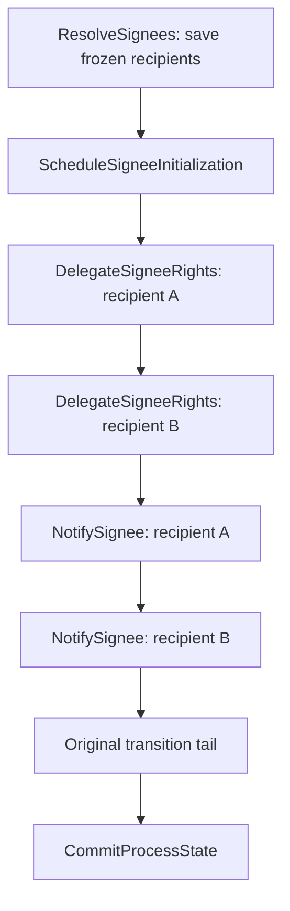

# Per-signee signing initialization experiment

This experiment moves runtime delegated signing from one bulk command into stable ordinary workflow commands with
recipient-level boundaries. It builds on the ordinary process-task command API from the bulk signing branch and uses current main’s versioned
aggregate writes and process-status ownership. The bulk implementation remains on `feat/robust-signee-initialization`.

## Scope and topology

`SigningProcessTask` declares `ResolveSignees` and `ScheduleSigneeInitialization` when runtime delegation is
configured. Resolution stores the frozen recipient list and opaque recipient IDs in the task's signee-state data.
The scheduler creates a dependent continuation containing one `DelegateSigneeRights` command for each recipient,
then one `NotifySignee` command for each recipient, followed by the original transition tail and its existing
`CommitProcessState` step. Signing remains in initialization until these steps complete.

The preparation and continuation workflows are sequential and remain under the process engine's normal processing
ownership. There are no per-instance leases and no separate notification workflows.

Each ordinary command receives a stable key and a serialized per-task payload. The task ID comes from that payload,
not from ambient current-task state. The scheduler preserves the original transition labels and carries the remaining
commands into the dependent continuation. A continuation is created only after preparation succeeds, so preparation
is never repeated as part of the transferred tail.

## Retry and state

A successful delegation mutates the aggregate before the next recipient command runs. A retry therefore starts at
the failed recipient and does not repeat completed grants. The engine owns workflow status, retry counts, backoff,
and terminal errors. Storage owns successful delegation and notification facts and the frozen identities from which external notification keys are derived.

External operations are at-least-once. Access Management and Correspondence must tolerate a repeated request after a
response or callback save is lost. A stable task-entry and recipient identity is used to derive notification keys.
The process engine serializes active work. Process ownership remains `Processing` through retries and failures,
so another transition cannot change the shared state before `CommitProcessState` releases ownership. No instance
lease is acquired.

Small, configured signing and payment state documents travel in the signed callback snapshot with their exact blob
versions. This lets a retry read its original input even after an accepted write loses its response, then reach
Storage’s aggregate replay handling. PDFs and arbitrary attachments are not copied into this snapshot.

The signee provider can run again when the resolve step itself retries. If the first attempt already saved a list,
Storage replays that mutation and retains the original recipients and IDs. Downstream recipient retries do not run
the provider again.

Notifications are ordinary per-recipient commands in the same sequential continuation. A permanent failure that
concerns one recipient does not hold the workflow: a refused delegation or a refused message is recorded on that
signee's state, with a structured code and a short reason, and the continuation carries on to the commit. The
signing state API reports the code, the signee list shows it, and the instance owner can reject the task to correct
the data. A signee whose notification failed can still sign. Only failures that would repeat for every recipient
fail the step: a refused app credential or scope, a Maskinporten token the app cannot obtain, the instance owner not
resolving, or a removed configuration. Those are recovered with the existing process workflow resume operation
after the cause is fixed. The frontend shows the ordinary processing/failure screen while a workflow is failed, and a
failed transition has no citizen retry button.

Transport failures, timeouts, 408/429, and 5xx responses receive the configured bounded retry policy. Every other
4xx is permanent: it is recorded against the recipient, except that 401/403 and any Maskinporten failure are treated
as app-wide, since the credential is the app's rather than the recipient's. Dependency response text is mapped to
the command result and is not exposed as an engine error contract.

## Compatibility and trade-offs

The recipient list remains in the configured signee-state data type. Existing pre-engine signing instances retain
their stored signing data and continue through the legacy compatibility path. Previously enqueued experimental
workflow shapes are not migrated.

The continuation must fit the engine's configured `MaxStepsPerWorkflow` (default 50). Its size is the number of
recipients plus the original remaining transition commands and the notification commands. Recipient lists larger
than that limit require a future continuation-splitting design; recipients are never silently truncated.

The benefit is isolated retry and durable progress per recipient while keeping all process work in the engine's normal
workflow ownership. The cost is additional workflow steps and longer initialization for larger recipient lists.

## Test matrix

The focused signing tests cover:

- one delegation command per recipient and one notification command per recipient;
- transient delegation failure and retry without repeating successful recipients;
- transient and permanent notification failures with stable idempotency keys;
- workflow resume after a failed delegation or exhausted notification retry;
- task-exit and re-entry behavior, including stale task-entry protection;
- lost external responses and recovery from facts already saved in Storage;
- legacy pre-engine instances completing and rejecting without initialization.

## Verification

Verified on September 9, 2026, against main through `804449c4d5`:

- The full backend solution builds. Existing dependency audit warnings remain.
- Core: 3,971 passed, two platform-specific skips. API: 603 passed, one platform-specific skip.
- All 106 enabled integration cases passed across the full run and focused rerun; one fixture test is skipped.
  The full run found four snapshot/harness issues, which were corrected; all 37 cases in the affected classes
  and the signing smoke test then passed. Tests used freshly packed libraries and a private current-main
  workflow engine/localtest environment.
- Localtest: 98 passed, including delegation and revocation idempotency.
- Fiks client, analyzer, source-generator, and source-generator integration suites: 501 passed.
- Frontend: 102 signing/process tests passed, and TypeScript checking passed.
- Changed-file spelling and agent-documentation checks passed.

Integration verification exercises HTTP behavior with the real local engine and Storage emulator. Frontend component
tests used current sources; the HTTP test harness reused existing frontend assets, and browser rendering was not
manually verified. External delegation and Correspondence failure injection remains simulated by the test app.
