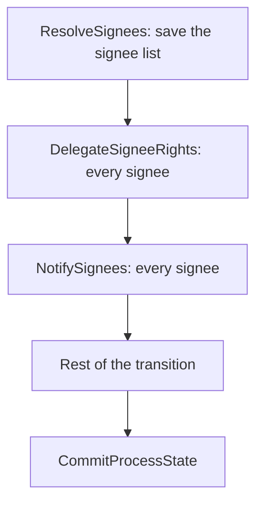

# Delegated signing initialization

Runtime-delegated signing initializes its signees as three ordinary process-task commands on the transition that
enters the signing task. It builds on the ordinary process-task command API and uses current main's versioned
aggregate writes and process-status ownership.

## Scope and topology

`SigningProcessTask` declares `ResolveSignees`, `DelegateSigneeRights` and `NotifySignees` as its start commands
when runtime delegation is configured. All three carry the same per-task payload, so the task ID comes from the
payload rather than from ambient current-task state. They are three steps of the transition's own workflow,
followed by the rest of the transition and its `CommitProcessState` step. There is no scheduler, no second
workflow, and no per-recipient step. Signing remains in initialization until these steps complete.

Three steps rather than one so that each commits its progress: a retry after the delegation step completed re-runs
only the notification, and a resume after a terminal failure picks up at the failed step. Within a step the
recipients are processed in a loop, and the outcome is written once, at the end, through the step's aggregate save
boundary.

## Retry and state

Both external calls are safe to repeat, so per-recipient checkpoints are not needed. Access Management merges a
repeated grant, and Correspondence answers a repeated idempotency key with 409, which the app treats as already
sent. A step that fails transiently persists nothing and is retried whole; the signees it already reached are
reached again with the same keys and the repeats are absorbed.

The notification key is derived from the workflow id, the step id and the signee's identity (the party uuid, or
`partyId:<id>` when the uuid is unknown). The workflow id is new on every visit to the task and stable across
retries and resume, so the key is stable for a retried or resumed step and different on a new entry into the task.

The engine owns workflow status, retry counts, backoff and terminal errors. Storage owns the persisted delegation
and notification facts. Process ownership remains `Processing` through retries and failures, so another transition
cannot change the shared state before `CommitProcessState` releases ownership. No instance lease is acquired.

Small, configured signing and payment state documents travel in the signed callback snapshot with their exact blob
versions. This lets a retry read its original input even after an accepted write loses its response, then reach
Storage's aggregate replay handling. PDFs and arbitrary attachments are not copied into this snapshot.

The signee provider can run again when the resolve step itself retries. If the first attempt already saved a list,
the retry adopts that element instead of asking the provider again. The delegation and notification steps never run
the provider.

## Degradation

A permanent failure that concerns one signee does not hold the transition: a refused delegation or a refused
message is recorded on that signee's state, with a structured code and a short reason, and the step still
completes. The signing state API reports the code, the signee list shows it, and the instance owner can reject the
task to correct the data. A signee whose notification failed can still sign, and a signee whose delegation was
refused is skipped by the notification step rather than told to sign something they cannot.

Only a failure that would repeat for every signee fails the delegation step: a refused app credential or scope, a
Maskinporten token the app cannot obtain, the instance owner not resolving, or a removed configuration. Those are
recovered with the existing process workflow resume operation after the cause is fixed. The frontend shows the
ordinary processing/failure screen while a workflow is failed, and a failed transition has no citizen retry button.

Notification never blocks the transition. An app-wide notification failure — a missing correspondence resource, the
service owner's party not resolving — is recorded on every signee still waiting and the step still completes.

Transport failures, timeouts, 408/429 and 5xx responses receive the configured bounded retry policy. Every other
4xx is permanent: it is recorded against the signee, except that 401/403 and any Maskinporten failure are treated
as app-wide, since the credential is the app's rather than the signee's. Dependency response text is mapped to the
command result and is not exposed as an engine error contract.

## Compatibility

The signee list remains in the configured signee-state data type. Existing pre-engine signing instances retain
their stored signing data and continue through the legacy compatibility path.

## Test matrix

The focused signing tests cover:

- one delegation step and one notification step for the whole signee list;
- transient delegation failure and retry without repeating what an earlier step committed;
- transient and permanent notification failures with stable idempotency keys;
- app-wide delegation failure blocking the commit until the workflow is resumed;
- workflow resume after a failed delegation or exhausted notification retry;
- lost external responses and recovery from facts already saved in Storage;
- legacy pre-engine instances completing and rejecting without initialization.
