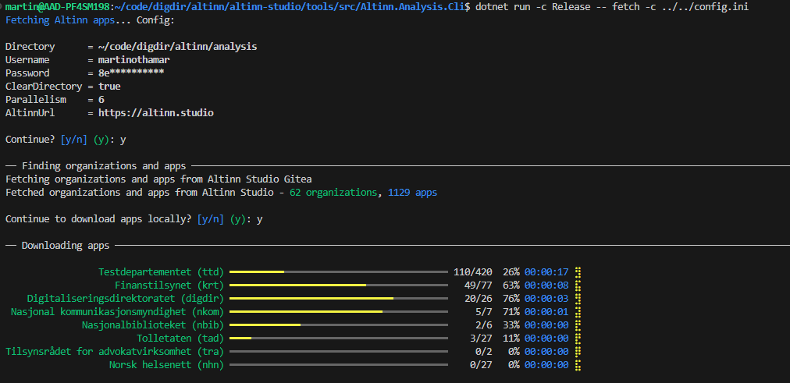
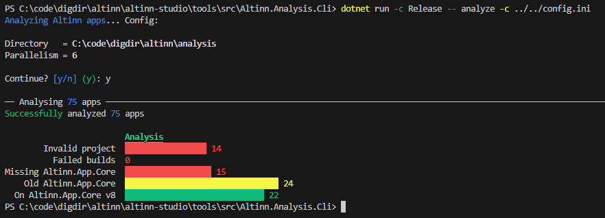

# Apps analysis

Meant to gather statistics on code from all apps in Altinn 3.

## Prereqs

Authenticate with studioctl:

```sh
studioctl auth login
```

Optional: a config file at `config.ini`

```sh
cp config.sample.ini config.ini
```

Make the appropriate changes. Git credentials are read from `studioctl auth git-credential`.

Example

```ini
directory=C:\code\digdir\altinn\analysis
clear_directory=true
```

This would target Altinn Studio prod by default.

## Run

Go into CLI directory:

```sh
cd src/Altinn.Analysis.Cli
```

Fetch

```sh
dotnet run -c Release -- fetch -c ../../config.ini
```

This writes `manifest.json` to the fetch directory with an index of fetched apps,
including whether each app is deployed to `tt02`, `prod`, or both.



Analyze

```sh
dotnet run -c Release -- analyze -c ../../config.ini
```


