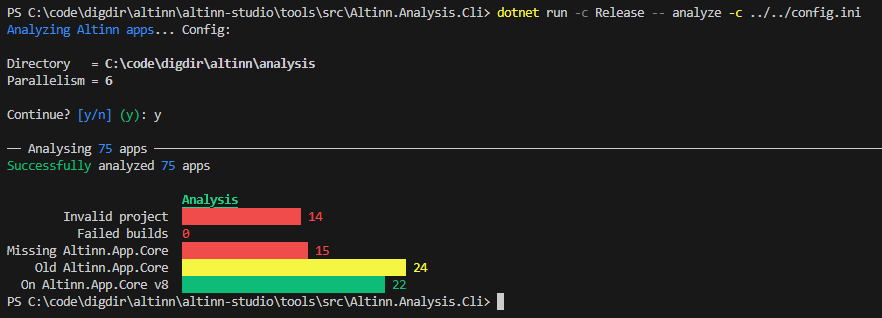

# Altinn tools

Tools for Altinn platform developers to do various things.

## Apps analysis

Meant to gather statistics on code from all apps in Altinn 3.

### Prereqs

A config file at `config.ini`
```sh
cp config.sample.ini config.ini
```
Make the appropriate changes.
The password needs to be a token from Altinn Studio with `Read` permissions for `organization` and `repository` scope.

Example
```ini
username=martinothamar
password=8e************************
directory=C:\code\digdir\altinn\analysis
clear_directory=true
```

This would target Altinn Studio prod by default.

### Run

Go into CLI directory:
```sh
cd src/Altinn.Analysis.Cli
```

Fetch
```sh
dotnet run -c Release -- fetch -c ../../config.ini
```

 

Analyze
```sh
dotnet run -c Release -- analyze -c ../../config.ini
```

 
